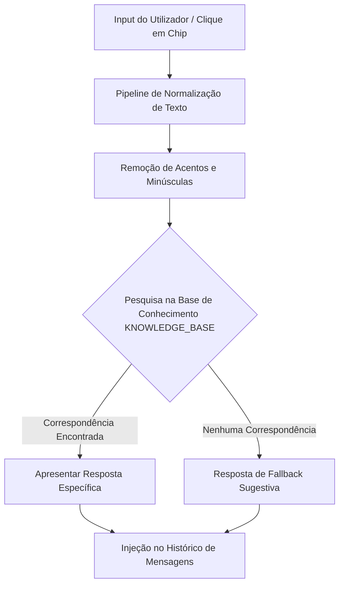

# Documentação Técnica: Assistente Virtual Melita (Hexomel)

## 1. Introdução
Como parte das melhorias de acessibilidade e experiência de utilizador (UX) na plataforma Hexomel, foi desenvolvido a **Melita**, a assistente virtual e mascote oficial do site. A Melita foi desenhada para guiar o utilizador, responder a dúvidas frequentes sobre o mel, workshops e contactos, e facilitar o fluxo de navegação dentro do ecossistema Hexomel.

---

## 2. Arquitetura e Funcionamento Geral
Diferente de soluções pesadas baseadas em APIs de LLM externas, que poderiam introduzir latência no carregamento, custos de subscrição e problemas de privacidade, a Melita implementa um **motor de correspondência de intenções baseado em regras híbridas no frontend**. 

Este motor reside no ficheiro `chatbot.js`, sendo carregado de forma assíncrona e injetado diretamente no DOM após o carregamento inicial da página (`DOMContentLoaded`), minimizando o impacto no tempo de carregamento da aplicação (Performance First).

---

## 3. Pipeline de Processamento de Perguntas (Processamento de Linguagem Natural Simplificado)
Para garantir que as perguntas dos utilizadores sejam interpretadas corretamente, independentemente da forma como são digitadas (com ou sem acentuação, maiúsculas ou minúsculas), a query passa por um fluxo de tratamento de dados:

1. **Conversão para Minúsculas**: O texto é convertido com `.toLowerCase()`.
2. **Normalização Unicode NFD**: O texto é decomposto em caracteres base e diacríticos através do método `.normalize("NFD")`.
3. **Remoção de Acentos**: Os diacríticos (acentos, cedilhas, tilts) são removidos usando a expressão regular `/[\u0300-\u036f]/g`. 
   - *Exemplo*: `"Quem é a Melita?"` torna-se `"quem e a melita?"`.
4. **Correspondência Regex**: A string limpa é testada contra os padrões regex de cada categoria da base de conhecimento (`KNOWLEDGE_BASE`).

---

## 4. Base de Conhecimento e Padrões de Perguntas Previstos

A base de conhecimento está totalmente internacionalizada (suporta Português e Inglês) e encontra-se dividida em 10 intenções principais. Cada intenção possui uma ampla gama de padrões previstos para cobrir o máximo de variações de perguntas possíveis:

### 4.1. Saudações (`greetings`)
*   **Padrões Previstos (Regex)**: `olá`, `oi`, `bom dia`, `boa tarde`, `boa noite`, `olás`, `hey`, `boas`, `salve`, `alô`, `tudo bem`, `como vais`, `como estás`.
*   **Ação/Resposta (PT)**: *"Olá! Sou a Melita, a assistente virtual do Hexomel. Como posso ajudar-te hoje? Podes perguntar-me sobre os nossos produtos, workshops, como comprar, a rede social ou contactos! 🐝"*

### 4.2. Identidade da Assistente (`whois`)
*   **Padrões Previstos (Regex)**: `quem é a melita`, `quem és tu`, `sobre ti`, `apresenta-te`, `apresentação`, `o que fazes`, `como te chamas`, `teu nome`, `assistente virtual`, `melita`.
*   **Ação/Resposta (PT)**: *"Eu sou a Melita, a assistente virtual do Hexomel. Fui programada para ajudar os utilizadores a obter informações sobre o site, os nossos produtos e workshops. 😊"*

### 4.3. Loja, Produtos e Compras (`products`)
*   **Padrões Previstos (Regex)**: `mel`, `méis`, `produto`, `produtos`, `loja`, `shop`, `comprar`, `preço`, `venda`, `encomendar`, `compras`, `pagar`, `pagamento`, `carrinho`, `adicionar`, `valor`, `custo`, `portes`, `envio`, `entrega`, `frasco`, `artesanal`, `biológico`.
*   **Ação/Resposta (PT)**: *"No Hexomel oferecemos méis artesanais e biológicos de qualidade premium, colhidos na Serra da Estrela! 🍯 Temos Mel de Rosmaninho (suave e aromático), Mel de Urze (intenso e antioxidante) e Mel de Castanheiro (robusto e amadeirado). Podes explorar todos eles e comprá-los de forma segura na nossa Loja Online. Basta adicionares ao carrinho!"* (Contém link direto `/loja`).

### 4.4. Workshops de Apicultura (`workshops`)
*   **Padrões Previstos (Regex)**: `workshop`, `workshops`, `curso`, `cursos`, `aprender apicultura`, `aula`, `aulas`, `agenda`, `datas`, `inscrição`, `inscrições`, `participar`, `inscrever`, `formação`, `apicultura`, `evento`, `experiência`.
*   **Ação/Resposta (PT)**: *"Gostarias de ser apicultor por um dia? 🐝 Nós organizamos Workshops de Apicultura! Neles podes aprender sobre a vida das abelhas, a colheita de mel e visitar as colmeias em segurança com equipamento adequado. Vê as próximas datas e faz a tua inscrição na nossa página de Workshops!"* (Contém link direto `/workshops`).

### 4.5. Autenticação e Gestão de Conta (`auth`)
*   **Padrões Previstos (Regex)**: `login`, `entrar`, `iniciar sessão`, `registar`, `registo`, `criar conta`, `conta`, `perfil`, `logout`, `password`, `palavra-passe`, `esqueci`, `recuperar`, `minha conta`, `painel`, `dashboard`, `dados`, `alterar`, `sair`.
*   **Ação/Resposta (PT)**: *"Podes criar uma conta no Hexomel para comprar mel, inscrever-te em workshops e aceder à nossa rede social! 🐝 Se já tens conta, faz Iniciar Sessão. Se és novo, podes Registar-te. Queres que eu abra a janela para entrares ou te registares?"*
*   **Comportamento Dinâmico**: Esta resposta injeta dois botões de ação rápida no chat ("Iniciar Sessão" e "Registar") que abrem diretamente a janela de autenticação modal do website (`window.openAuthModal`), melhorando a conversão e experiência de utilizador.

### 4.6. Parcerias e Produtores (`beekeepers`)
*   **Padrões Previstos (Regex)**: `apicultor`, `apicultores`, `vender`, `parceiro`, `parceria`, `colmeia`, `colmeias`, `produzir`, `produtor`, `produtores`, `produzir mel`, `vender mel`, `ser parceiro`, `registar como apicultor`, `painel apicultor`.
*   **Ação/Resposta (PT)**: *"A nossa missão é apoiar a apicultura local! 🍯 Se és um apicultor e queres vender o teu mel no Hexomel, podes registar-te como Apicultor. Terás acesso a um painel exclusivo para gerir o teu mel, vendas e colmeias. Sabe mais na nossa página de Apicultores!"* (Contém link direto `/apicultores`).

### 4.7. Contactos e Localização (`contacts`)
*   **Padrões Previstos (Regex)**: `contacto`, `contactos`, `telefone`, `email`, `suporte`, `ajuda`, `morada`, `localização`, `onde fica`, `onde ficam`, `sede`, `whatsapp`, `falar`, `escrever`, `ligar`, `telefonar`, `mensagem`, `rua`, `local`, `mapa`, `apoio`, `reclamar`, `reclamação`.
*   **Ação/Resposta (PT)**: *"Estamos sempre aqui para ajudar! 📞 Podes contactar-nos na página de Contactos, por email em hexomelpap@gmail.com ou por telefone: +351 912 345 678. A nossa sede fica na bela região da Serra da Estrela, Portugal."* (Contém link direto `/contactos`).

### 4.8. Rede Social HexoHive (`social`)
*   **Padrões Previstos (Regex)**: `social`, `rede social`, `hexohive`, `comunidade`, `membros`, `posts`, `mensagens`, `fórum`, `forum`, `hive`, `partilhar`, `publicar`, `publicação`, `postar`, `amigos`, `chat`, `conversar`, `mensagens privadas`.
*   **Ação/Resposta (PT)**: *"O HexoHive é a nossa rede social exclusiva! 🐝 Lá podes partilhar publicações, fotos das tuas colmeias, dicas de apicultura e interagir com outros membros da comunidade. Acede à Rede Social ou junta-te às discussões no Fórum Comunitário!"* (Contém links diretos `/rede-social` e `/comunidade`).

### 4.9. Curiosidades Científicas do Mel (`curiosities`)
*   **Padrões Previstos (Regex)**: `curiosidades`, `curiosity`, `abelhas`, `polinização`, `rainha`, `obreira`, `zangão`, `factos`, `fatos curiosos`, `importância`, `ciência`, `científico`, `estranho`, `interessante`, `benefícios`, `saúde`, `propriedades`, `expirar`, `valer`, `estragar`.
*   **Ação/Resposta (PT)**: *"Sabias que as abelhas são cruciais para a polinização de um terço dos alimentos que consumimos? 🐝 E o mel puro é o único alimento que nunca se estraga! Podes aprender mais factos científicos incríveis na nossa página de Curiosidades ou consultar materiais de estudo em Aprender!"* (Contém links diretos `/curiosidades` e `/aprender`).

### 4.10. Sobre Nós e Conceito da Marca (`about`)
*   **Padrões Previstos (Regex)**: `sobre`, `história`, `missão`, `quem somos`, `equipa`, `fundador`, `origem`, `empresa`, `valores`, `autenticidade`, `qualidade`, `sustentabilidade`, `criador`, `hexomel`, `nome`.
*   **Ação/Resposta (PT)**: *"O Hexomel nasceu do desejo de unir a tradição da apicultura portuguesa à experiência digital. O nome combina “Hexo” (o hexágono dos favos) com “Mel”. Conhece a nossa equipa e a nossa história na página Sobre Nós!"* (Contém link direto `/sobre-nos`).

---

## 5. Sistema de Fallback Inteligente
Caso o utilizador envie uma mensagem que não corresponda a nenhum dos padrões regex pré-definidos (por exemplo, *"Qual é a previsão do tempo?"*), a Melita executa uma resposta de fallback polida e útil:

> *"Desculpa, mas só consigo responder a questões relacionadas com o site do Hexomel (como os nossos méis, workshops, rede social, conta ou contactos). 🍯*
>
> *Tenta perguntar algo como:*
> - *'Como comprar mel?'*
> - *'Quais os workshops?'*
> - *'O que é o HexoHive?'*
> - *'Qual o vosso contacto?'"*

Este comportamento redireciona o utilizador de volta para os tópicos em que a assistente é útil, mantendo a experiência focada e profissional.

---

## 6. Integração Frontend e Detalhes de Interface (UI/UX)
A interface da Melita foi totalmente personalizada em CSS (`chatbot.css`) para se alinhar com a identidade estética e moderna da Hexomel:

*   **Pulsing FAB (Floating Action Button)**: No canto inferior direito, um botão circular com sombra pulsante suave e animação de rotação/escala convida o utilizador a interagir. Exibe uma foto real de abelha (`/images/bee/abelha.webp`).
*   **Tooltip de Boas-Vindas**: Uma bolha de texto surge brevemente acima do FAB ao carregar o site para chamar a atenção, desaparecendo automaticamente após 8 segundos ou após ser fechada.
*   **Janela de Chat Premium (Glassmorphism)**: Utiliza `backdrop-filter: blur(12px)` e fundos translúcidos com bordas finas para um aspeto premium e limpo.
*   **Indicador de Escrita Animado (Typing Indicator)**: Três pontos com efeito de salto (*bounce*) simulam que a assistente está a processar a resposta, com um atraso natural de 700ms antes de renderizar a bolha de mensagem da bot.
*   **Chips de Sugestão**: Ao abrir o chat pela primeira vez, são apresentados 4 botões de sugestão que permitem fazer as perguntas principais com um único clique.
