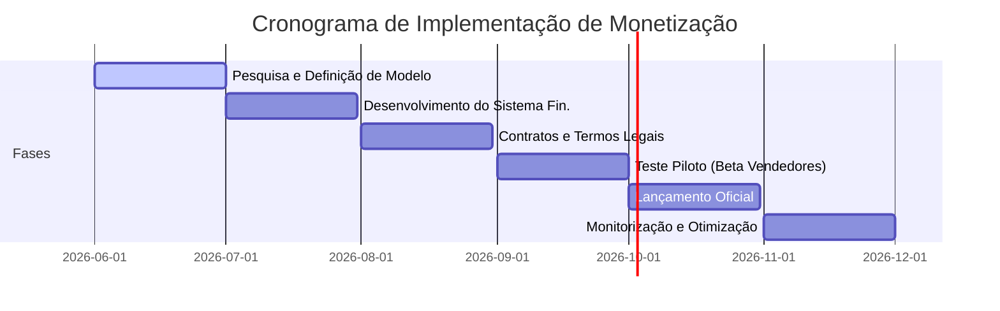

# Estudo de Monetização e Propostas de Lucro: Hexomel

Este relatório analisa estratégias de monetização para o **Hexomel** (um mercado online B2C de mel português) e recomenda ações práticas para maximizar o lucro do gestor do marketplace, equilibrando a competitividade para os apicultores.

---

## 1. Resumo Executivo

Este estudo visa analisar e propor modelos de monetização sustentáveis para a plataforma Hexomel. Para efeitos de simulação financeira e planeamento, foram definidos os seguintes parâmetros iniciais baseados numa estimativa de mercado para um website em fase de crescimento:
- **GMV Mensal Estimado (Gross Merchandise Value)**: **€50.000** (assumindo uma média de **1.000 transações/mês** com um ticket médio de **€50**).
- **Custos Operacionais Fixos**: **€2.000/mês** (incluindo alojamento web profissional, licenças de software, salários de equipa de suporte e marketing digital).
- **Custos Operacionais Variáveis**: Taxas de gateway de pagamento eletrónico estimadas em **2% do GMV** (€1.000/mês).

Após simulações detalhadas comparando comissões de **5%, 10% e 20%**, conclui-se que o modelo de **10% de comissão** oferece o melhor equilíbrio, cobrindo todos os custos operacionais e gerando um lucro líquido mensal de **€2.000** (margem de lucro líquido de 40% sobre a receita), sem sobrecarregar excessivamente a margem do apicultor.

---

## 2. Descrição do Site, Produtos e Público-Alvo

O **Hexomel** é um marketplace B2C focado no mel de origem portuguesa e produtos derivados. 

### Catálogo de Produtos e Serviços:
* **Produtos Físicos**: Frascos de mel puro (monofloral e multifloral), coleções de sabores, geleias, favos de mel e kits gourmet/degustação.
* **Serviços Complementares**: Workshops presenciais ou virtuais com apicultores, consultoria apícola e turismo apícola.

### Público-Alvo:
* **Consumidores Finais (B2C)**: Adultos de **25-55 anos** residentes em Portugal ou turistas estrangeiros, conscientes da saúde, interessados em alimentação saudável, sustentabilidade e valorização de produtos artesanais e locais.
* **Fornecedores (Sellers)**: Pequenos e médios apicultores nacionais que necessitam de um canal digital moderno para escoar a sua produção e ganhar visibilidade sem o custo de gerir uma infraestrutura e-commerce própria.

---

## 3. Fluxos de Receita e Custos

Para diversificar o risco e maximizar o retorno, propõe-se um ecossistema misto de monetização:

### 3.1. Canais de Receita (Revenue Streams)

1. **Comissão por Venda (Take Rate)**: A principal fonte de receita. Uma percentagem cobrada sobre o valor total de cada transação (produto + frete). Taxa recomendada: **10%**.
2. **Taxa Fixa por Venda**: Uma taxa pequena cobrada por item vendido (ex: **€0,50**) para garantir receita mínima em produtos de baixo valor unitário.
3. **Subscrições/Pacotes Premium (Sellers)**: Mensalidades pagas por apicultores para aceder a recursos avançados (ex: relatórios de vendas aprofundados, taxa de comissão reduzida para 8%, suporte a uploads de vídeo para produtos).
4. **Publicidade e Destaques Internos (Upsells)**: Cobrança por destaque de produtos no carrossel da homepage, banners publicitários não intrusivos ou prioridade de pesquisa.
5. **Programa de Afiliados**: Parcerias com blogs de culinária e influenciadores digitais, gerando um split de comissões por compras recomendadas.

### 3.2. Estrutura de Custos (Cost Structure)

* **Custos Fixos**:
  * Alojamento do site e infraestrutura de servidores cloud (€30 a €100/mês).
  * Licenças de software e ferramentas de suporte.
  * Marketing digital (redes sociais, SEO, campanhas pagas) (€200 a €500/mês).
  * Custos de equipa de suporte ao cliente e administração.
* **Custos Variáveis**:
  * Gateway de pagamentos (ex: Stripe, MB Way) cobrando **1,5% a 3%** por transação.
  * Logística, envio e embalagem (quando geridos pela plataforma).
  * **IVA (Imposto sobre o Valor Acrescentado)**: Incide à taxa padrão (21% em Portugal) sobre a receita de comissões obtidas pelo marketplace.

---

## 4. Comparação de Modelos de Monetização

| Modelo | Descrição | Vantagens | Desvantagens / Limitações |
| :--- | :--- | :--- | :--- |
| **Comissão (%)** | Percentagem sobre o total da venda (5% - 20%). | Alinhamento direto com o sucesso do vendedor; popular em marketplaces. | Reduz margem direta do produtor; pode afastar vendedores se for muito alta. |
| **Taxa Fixa** | Valor fixo por venda (ex: €0,50 por transação). | Receita previsível e garantida; ideal para tickets médios baixos. | Penaliza produtos muito baratos se aplicada isoladamente. |
| **Subscrição** | Mensalidade paga por funcionalidades premium. | Receita recorrente estável (MRR) indepedente do volume de vendas. | Resistência de adesão inicial por parte de pequenos produtores. |
| **Publicidade/Destaques**| Venda de espaço visual ou listings patrocinados. | Margem muito elevada; aproveita tráfego qualificado. | Se for intrusivo, degrada a UX do site e afasta compradores. |
| **Programa de Afiliados**| Comissões pagas a terceiros por referências. | Baixo risco; custo apenas após a venda ser efetuada. | Requer um sistema complexo de tracking de links e cookies. |

---

## 5. Simulação de Cenários de Comissão e Lucro

Cenário base: **GMV Mensal de €50.000** e **Custos Fixos de €2.000/mês**. Custos variáveis de pagamento fixados em **2% do GMV (€1.000)**.

| Cenário de Comissão | Receita de Comissão (€/mês) | Custo Variável Gateway (€/mês) | Lucro Bruto (€/mês) | Custos Fixos (€/mês) | Lucro Líquido (€/mês) | Margem Líquida |
| :---: | :---: | :---: | :---: | :---: | :---: | :---: |
| **5%** | €2.500 | €1.000 | €1.500 | €2.000 | **-€500 (Prejuízo)** | -20% |
| **10%** | €5.000 | €1.000 | €4.000 | €2.000 | **€2.000 (Lucro)** | +40% |
| **20%** | €10.000 | €1.000 | €9.000 | €2.000 | **€7.000 (Lucro)** | +70% |

### Análise dos Cenários:
* **Cenário 5%**: Insustentável. A receita de comissões não cobre os custos operacionais fixos e taxas de pagamento, resultando num fluxo de caixa negativo mensal de €500.
* **Cenário 10%**: Recomendado. Cobre com segurança os custos de infraestrutura e marketing, permitindo reinvestimento contínuo de €2.000 mensais no crescimento do site.
* **Cenário 20%**: Lucrativo, mas arriscado. Pode causar uma fuga de apicultores para plataformas concorrentes ou canais de venda direta.

### Fórmula de Margem para Vendedores:
Para mitigar a perda de lucro, o apicultor deve ajustar o seu **Preço de Venda (PV)** para incorporar a comissão, utilizando a fórmula:
\[PV = \frac{Custo + Lucro\ Desejado}{1 - \%comissao}\]
*Exemplo prático*: Se o custo de produção + lucro desejado for de €18,00 e a comissão for de 10%:
\[PV = \frac{€18,00}{1 - 0.10} = €20,00\]
O apicultor vende por €20,00, a plataforma retém €2,00 (10%) e o apicultor recebe exatamente os seus €18,00 pretendidos.

---

## 6. Recomendações Legais, Fiscais e de UX

### Legislação e Fiscalidade:
* **Incidência de IVA**: Em Portugal, o operador do marketplace fatura e cobra IVA (21%) **apenas sobre a receita das comissões** (serviço prestado ao vendedor). A venda do produto físico é faturada diretamente pelo apicultor ao consumidor final.
* **OSS (One Stop Shop)**: Recomendado o registo no portal do IVA OSS para facilitar a declaração de IVA transfronteiriço caso o site venda para clientes noutros estados-membros da União Europeia.
* **GDPR / LGPD**: Transparência absoluta na retenção de dados dos clientes e vendedores.

### Experiência do Utilizador (UX):
* **Transparência para Vendedores**: Criação de um dashboard administrativo para o apicultor que exiba claramente as Vendas Brutas (GMV), a Taxa de Comissão retida e os Ganhos Líquidos transferidos, evitando surpresas financeiras.
* **Checkout Limpo**: Não exibir a comissão da plataforma ao comprador final (o preço do produto já deve ser o preço final com tudo embutido) para evitar fricção no carrinho de compras.

---

## 7. Riscos e Mitigação

1. **Preço vs. Competitividade**:
   * *Risco*: Taxa de comissão elevada afasta apicultores.
   * *Mitigação*: Implementar comissões progressivas baseadas em volume de vendas (ex: começa a 10%, reduz para 8% após €5.000 em vendas acumuladas).
2. **Volumetria Insuficiente**:
   * *Risco*: Baixo tráfego impossibilita cobrir os €2.000 de custos fixos.
   * *Mitigação*: Lançamento inicial de campanhas de tráfego orgânico (SEO) focadas em mel artesanal português e parcerias diretas com cooperativas apícolas locais.
3. **Falhas Financeiras e Confiança**:
   * *Risco*: Atrasos nas transferências e erros nos cálculos.
   * *Mitigação*: Automatizar os fluxos financeiros utilizando integrações como o Stripe Connect (split payments automático no ato da compra).

---

## 8. Cronograma de Implementação (6 Meses)

A transição para o modelo de monetização será dividida em 6 fases de 1 mês cada:

---

## 9. KPIs a Monitorizar

Para avaliar a saúde financeira do marketplace, devem acompanhar-se os seguintes indicadores:
- **Take Rate (Taxa de Captura)**: Percentagem do volume de transações que a plataforma retém (alvo: 10%).
- **Receita Líquida Mensal**: Faturação de comissões deduzindo taxas de gateway e impostos.
- **CAC (Custo de Aquisição de Cliente)**: Custo total de marketing dividido pelo número de novos clientes adquiridos.
- **CLTV (Customer Lifetime Value)**: Valor médio gasto por um cliente ao longo do seu ciclo de vida no Hexomel.
- **Número de Transações Ativas**: Contagem mensal de vendas.
- **Taxa de Conversão**: Percentagem de visitantes que efetivamente efetuam uma compra.
- **Utilizadores Ativos (MAU/DAU)**: Nível de engajamento diário e mensal na rede social e marketplace.
- **Margem de Lucro Bruta/Líquida**: Percentagem da receita de comissão que se converte em lucro após custos fixos.
