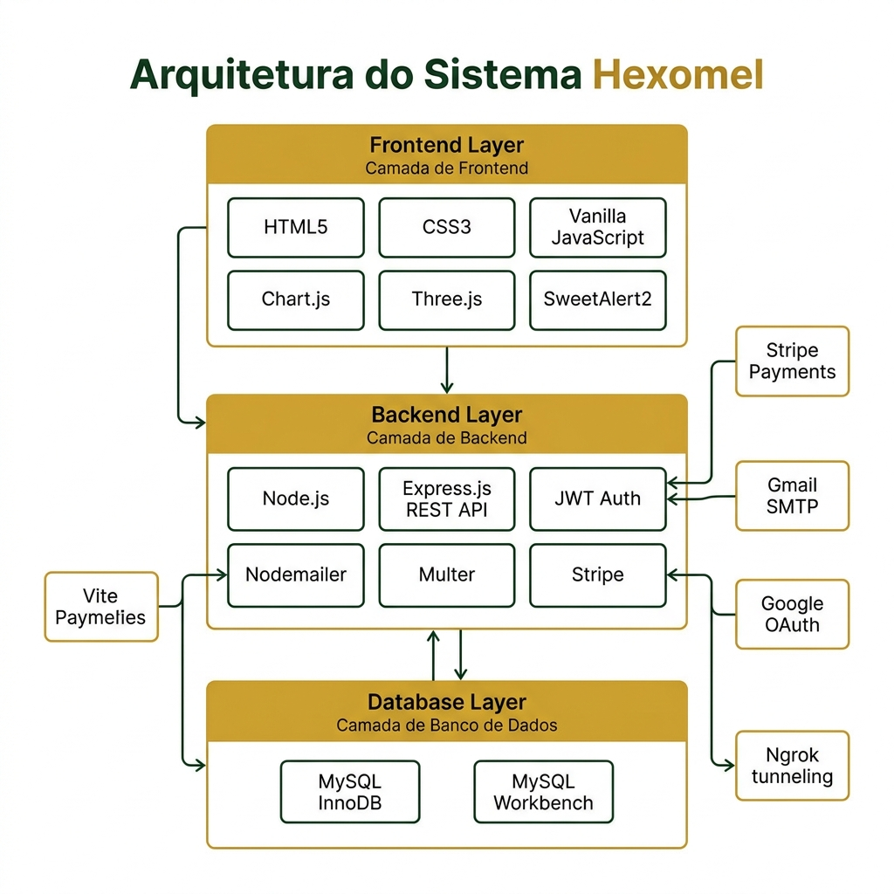
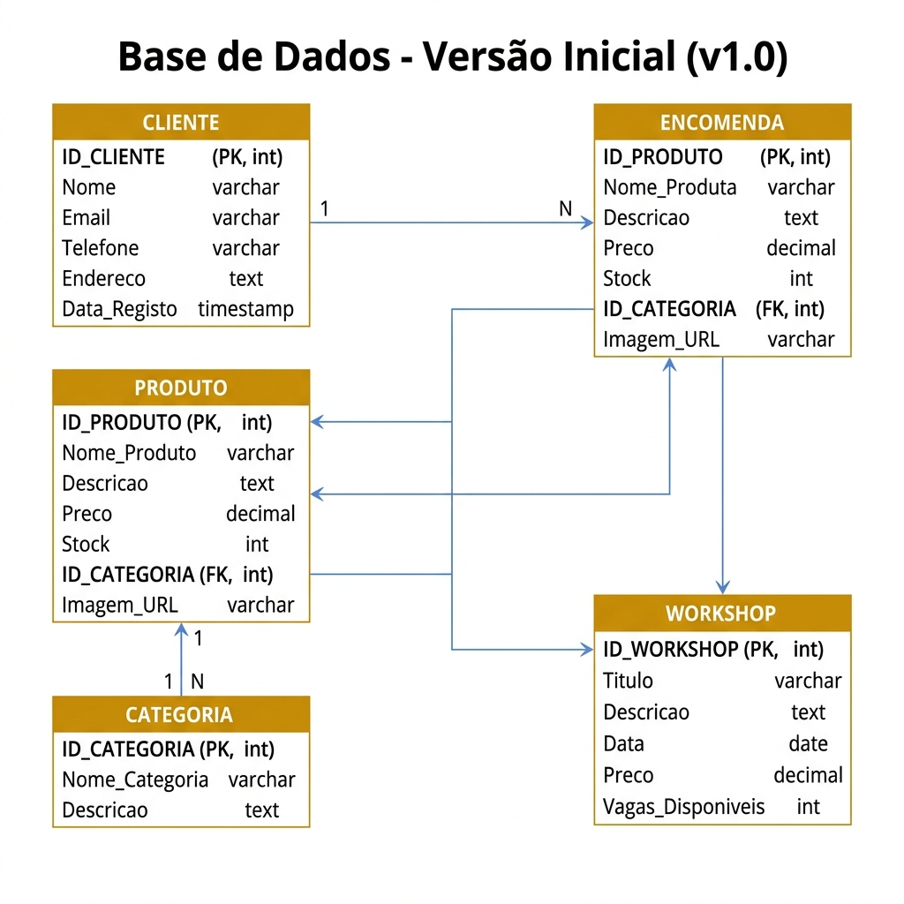
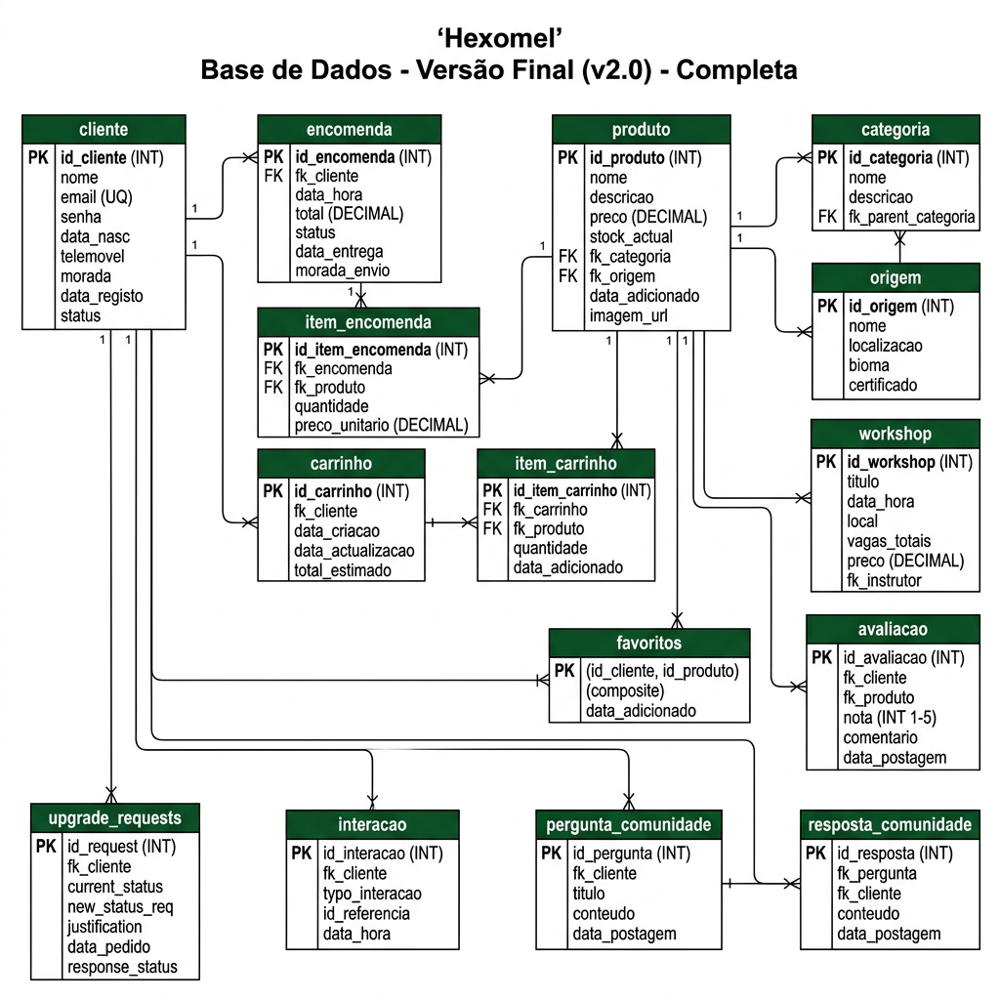
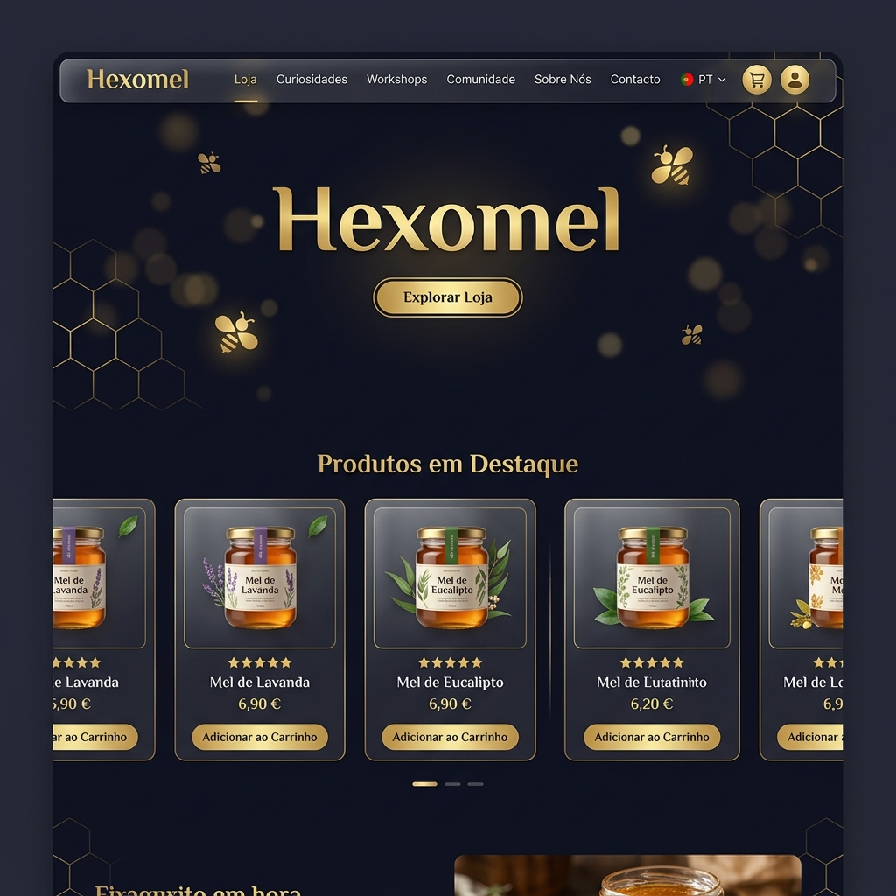
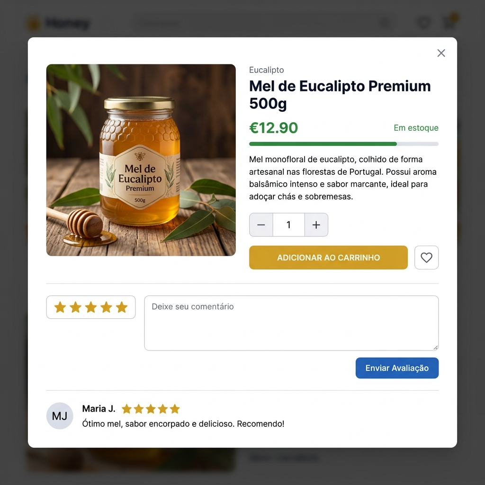
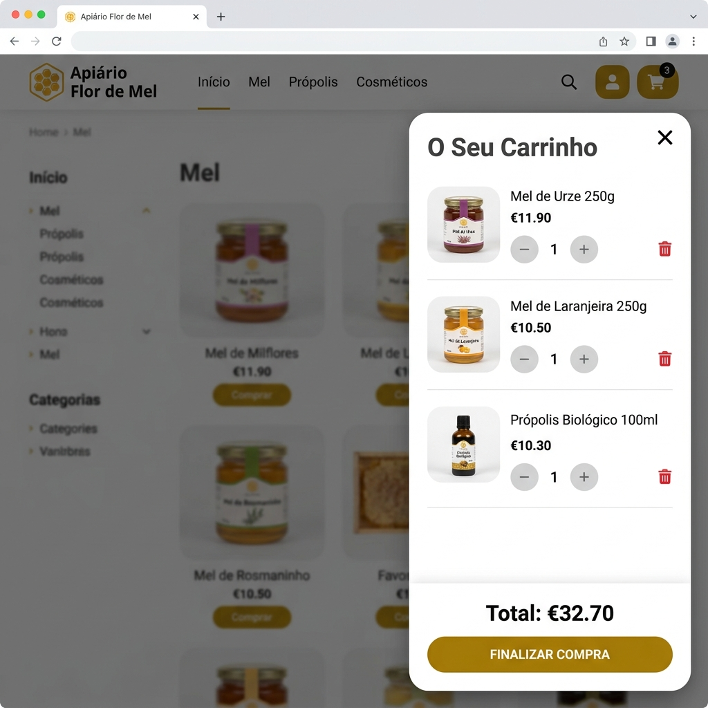
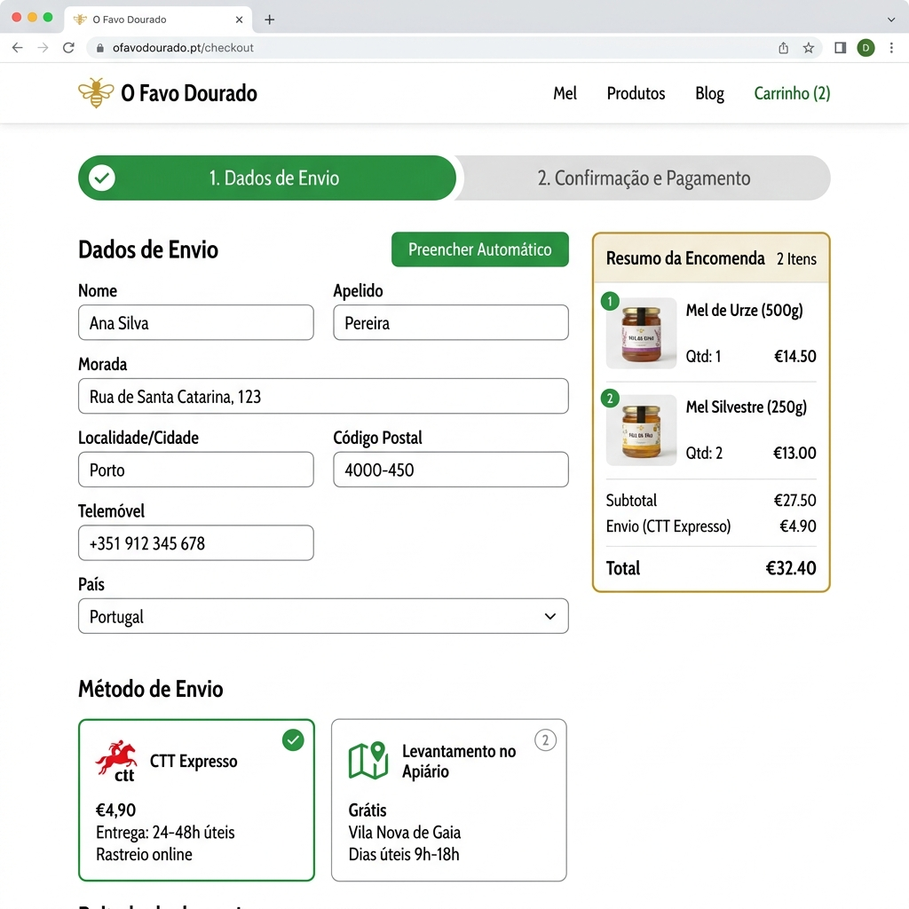
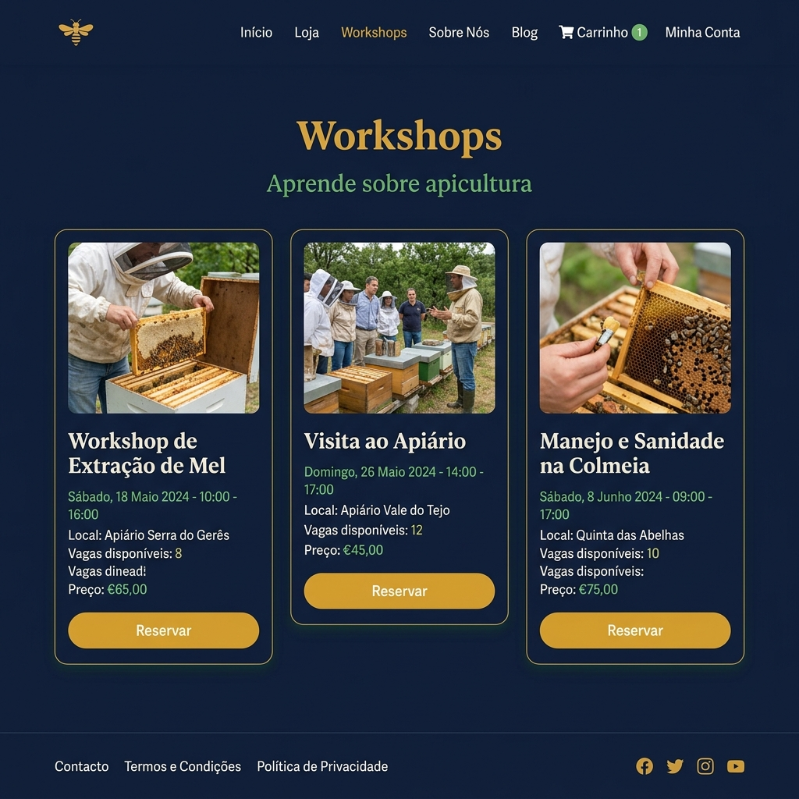
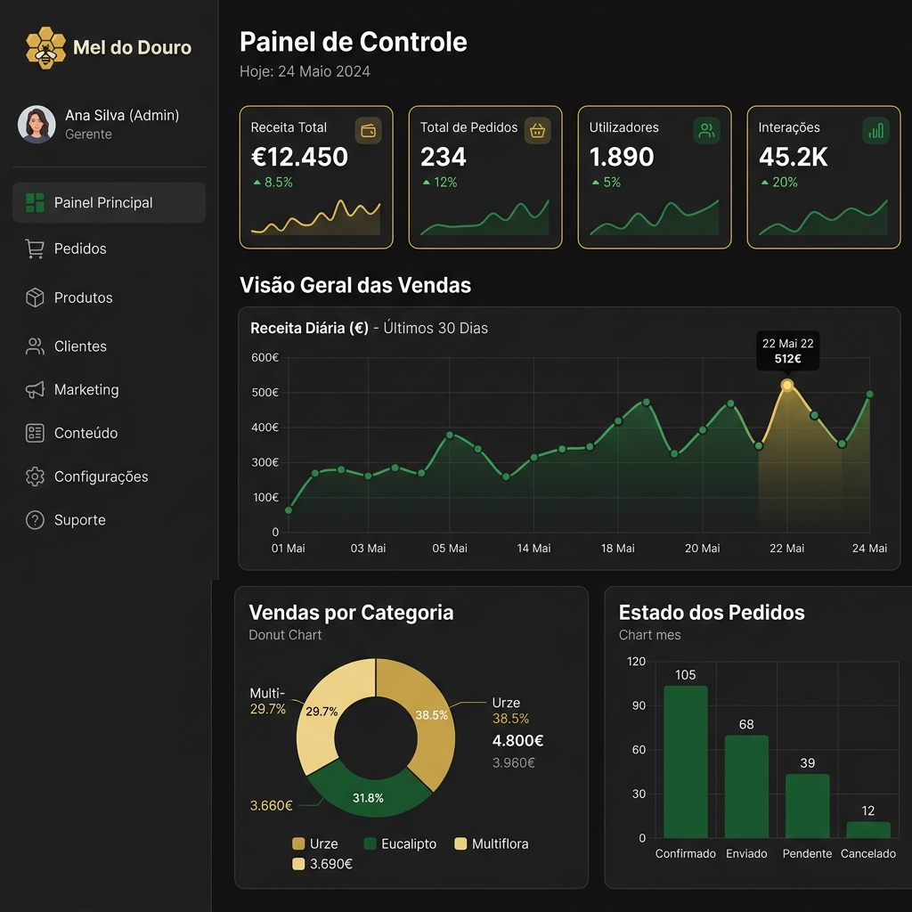

# Relatório de Prova de Aptidão Profissional (PAP)
## Hexomel — Plataforma de E-commerce de Mel Português

---

**Aluno:** Rodrigo Filipe Costa Silva  
**Curso:** Técnico de Informática e Tecnologias de Multimédia (ITM)  
**Escola:** Colégio de Gaia  
**Ano Letivo:** 2025/2026  
**Orientador:** Prof. Dr. *(Nome do Orientador)*  
**Local e Data:** Vila Nova de Gaia, julho de 2026  

---

<div style="page-break-after: always;"></div>

## Dedicatória

*Dedico este trabalho a todos os que me apoiaram ao longo deste percurso académico, em especial à minha família, pelo incentivo e paciência demonstrados durante a realização deste projeto, e aos meus professores, pela partilha constante de conhecimento.*

---

## Agradecimentos

Agradeço ao meu professor orientador pelo acompanhamento, rigor e disponibilidade demonstrados ao longo de todo o desenvolvimento deste projeto. Agradeço também ao Colégio de Gaia por proporcionar as condições excelentes para a minha formação técnica, científica e humana. Por fim, agradeço à minha família, amigos e colegas de curso pelo suporte incondicional e incentivo nos momentos de maior desafio.

---

<div style="page-break-after: always;"></div>

## Resumo

O presente relatório descreve o desenvolvimento do projeto **Hexomel**, uma plataforma de comércio eletrónico dedicada à comercialização de mel português artesanal, realizado no âmbito da Prova de Aptidão Profissional (PAP) do curso de Informática e Tecnologias de Multimédia.

O projeto tem como objetivo principal criar uma solução digital completa e funcional, que sirva de ponte direta entre produtores de mel (apicultores) e consumidores finais, através de uma experiência de utilizador de qualidade profissional. Para tal, foi desenvolvida uma aplicação web com frontend em HTML5, CSS3 e JavaScript Vanilla, backend em Node.js com Express.js e base de dados relacional MySQL.

O sistema implementa funcionalidades avançadas como autenticação multi-fator (JWT + 2FA por email), integração com o sistema de pagamentos Stripe, login social com Google OAuth, visualização 3D com Three.js, sistema de analytics comportamental e um fórum de comunidade Q&A.

**Palavras-chave:** E-commerce, Node.js, MySQL, JavaScript, API REST, Mel, Apicultura, JWT, Stripe, Colégio de Gaia.

---

<div style="page-break-after: always;"></div>

## Abstract

This report describes the development of **Hexomel**, an e-commerce platform dedicated to the commercialization of artisanal Portuguese honey, created as part of the Professional Aptitude Test (PAP) of the Informatics and Multimedia Technologies course.

The project's main objective is to create a complete and functional digital solution that bridges honey producers (beekeepers) and end consumers through a professional-quality user experience. To achieve this, a web application was developed with an HTML5, CSS3 and Vanilla JavaScript frontend, a Node.js/Express.js backend, and a MySQL relational database.

The system implements advanced features such as multi-factor authentication (JWT + 2FA via email), Stripe payment integration, Google OAuth social login, 3D visualization with Three.js, behavioral analytics and a community Q&A forum.

**Keywords:** E-commerce, Node.js, MySQL, JavaScript, REST API, Honey, Beekeeping, JWT, Stripe.

---

<div style="page-break-after: always;"></div>

## Índice Geral

1. [Introdução](#1-introdução)
   - 1.1 Escola — Colégio de Gaia
   - 1.2 Curso de Informática e Tecnologias de Multimédia
   - 1.3 Prova de Aptidão Profissional
2. [O Projeto Hexomel](#2-o-projeto-hexomel)
   - 2.1 Motivação e Contexto
   - 2.2 Objetivos
   - 2.3 Visão Geral do Sistema
3. [Arquitetura do Sistema](#3-arquitetura-do-sistema)
4. [Tecnologias Utilizadas](#4-tecnologias-utilizadas)
   - 4.1 Frontend — Camada de Apresentação
   - 4.2 Backend — Camada de Lógica de Negócio
   - 4.3 Serviços Externos e Ferramentas
   - 4.4 Justificação Global do Stack
5. [Base de Dados](#5-base-de-dados)
   - 5.1 Justificação do SGBD
   - 5.2 Evolução — Versão Inicial vs Versão Final
   - 5.3 Modelo Conceptual e Relacionamentos
   - 5.4 Modelo Lógico e Estruturas de Tabelas
   - 5.5 Modelo Físico (Código SQL DDL)
6. [A Aplicação: Desenvolvimento, Código e Interface](#6-a-aplicação-desenvolvimento-código-e-interface)
   - 6.1 Estrutura de Ficheiros do Projeto
   - 6.2 Módulo `api.js`
   - 6.3 Módulo `pre-load.js`
   - 6.4 Módulo `auth.js`
   - 6.5 Módulo `cart.js`
   - 6.6 Módulo `shop.js`
   - 6.7 Módulo `checkout.js`
   - 6.8 Módulo `analytics.js`
   - 6.9 Módulo `beeAnimation.js`
   - 6.10 O Backend — `server.js`
   - 6.11 Demonstração das Interfaces da Aplicação (Imagens, Legendas e Explicações)
   - 6.12 Processo de Desenvolvimento
   - 6.13 Decisões Técnicas e Aprendizagens
7. [Segurança e Autenticação](#7-segurança-e-autenticação)
8. [Interface e Experiência do Utilizador](#8-interface-e-experiência-do-utilizador)
9. [Conclusão](#9-conclusão)
10. [Referências Bibliográficas](#10-referências-bibliográficas)
11. [Glossário](#11-glossário)

---

<div style="page-break-after: always;"></div>

## Lista de Abreviaturas

| Sigla | Significado |
|-------|-------------|
| **API** | Application Programming Interface |
| **BD** | Base de Dados |
| **CSS** | Cascading Style Sheets |
| **FCT** | Formação em Contexto de Trabalho |
| **FK** | Foreign Key (Chave Estrangeira) |
| **HTML** | HyperText Markup Language |
| **HTTP** | HyperText Transfer Protocol |
| **HTTPS** | HyperText Transfer Protocol Secure |
| **i18n** | Internationalization (Internacionalização) |
| **ITM** | Informática e Tecnologias de Multimédia |
| **JS** | JavaScript |
| **JWT** | JSON Web Token |
| **OTP** | One-Time Password (Senha de Uso Único) |
| **PAP** | Prova de Aptidão Profissional |
| **PK** | Primary Key (Chave Primária) |
| **REST** | Representational State Transfer |
| **SGBD** | Sistema de Gestão de Base de Dados |
| **SMTP** | Simple Mail Transfer Protocol |
| **SPA** | Single Page Application |
| **SQL** | Structured Query Language |
| **TLS** | Transport Layer Security |
| **UX** | User Experience (Experiência do Utilizador) |
| **2FA** | Two-Factor Authentication (Autenticação de Dois Fatores) |

---

<div style="page-break-after: always;"></div>

## 1. Introdução

### 1.1 Escola — Colégio de Gaia

O Colégio de Gaia é uma instituição de ensino de referência, fundada em 1913 e localizada em Vila Nova de Gaia. Destaca-se pelo ensino técnico-profissional de dupla certificação, que prepara os jovens com elevados padrões científicos, tecnológicos e humanos. A escola confere diplomas de nível 4 do Quadro Nacional de Qualificações (QNQ), permitindo aos alunos o ingresso imediato no mercado de trabalho ou a continuação de estudos no ensino superior.

### 1.2 Curso de Informática e Tecnologias de Multimédia

O curso profissional de **Técnico de Informática e Tecnologias de Multimédia (ITM)** visa formar profissionais capazes de desenhar, programar, desenvolver e integrar soluções digitais interativas. A matriz curricular do curso oferece formação geral, científica e uma robusta componente técnica, englobando disciplinas como Programação Internet, Sistemas de Base de Dados, Técnicas de Programação e Projeto Multimédia, para além do estágio curricular em Formação em Contexto de Trabalho (FCT).

### 1.3 Prova de Aptidão Profissional

A **Prova de Aptidão Profissional (PAP)** constitui a etapa final e decisiva do percurso formativo no ensino profissional. Trata-se de um projeto tecnológico transdisciplinar que demonstra de forma prática os conhecimentos, atitudes e competências técnicas adquiridos ao longo dos três anos de curso. O desenvolvimento do **Hexomel** traduz esta síntese prática, aliando design de interface de excelência visual, desenvolvimento full-stack robusto, lógica relacional e segurança de ponta.

---

<div style="page-break-after: always;"></div>

## 2. O Projeto Hexomel

### 2.1 Motivação e Contexto

A apicultura artesanal representa um setor económico relevante em Portugal, sendo responsável pela produção de mel de elevadíssima qualidade e com denominações de origem protegida. Contudo, a vasta maioria dos apicultores são pequenos produtores familiares que enfrentam sérias barreiras de digitalização e logística, ficando dependentes de intermediários comerciais. 

O **Hexomel** surge para quebrar esta barreira, fornecendo uma plataforma digital que liga diretamente os apicultores portugueses ao cliente final. O projeto moderniza esta atividade económica ancestral, aliando-a às técnicas de desenvolvimento web e design multimédia modernos.

### 2.2 Objetivos

*   **Desenvolver** uma aplicação web comercial full-stack completa, robusta e escalável, sem depender de plataformas pré-fabricadas;
*   **Criar** uma experiência do utilizador (UX/UI) de excelência que atraia e fidelize o consumidor final;
*   **Implementar** um sistema de base de dados relacional completo para acomodar múltiplos perfis e transações complexas;
*   **Garantir** a segurança da plataforma integrando autenticação criptografada com JWT e validação 2FA;
*   **Integrar** soluções profissionais do mundo real, incluindo Stripe para pagamentos eletrónicos e Google OAuth para login facilitado.

### 2.3 Visão Geral do Sistema

A plataforma divide-se em três perfis de utilizador distintos:

*   👤 **Cliente:** Pode explorar o catálogo, filtrar produtos por categoria, origem e preço, comprar de forma segura com Stripe, avaliar produtos, adicionar favoritos e participar no fórum de comunidade;
*   🐝 **Apicultor:** Dispõe de um painel de gestão para registar produtos, acompanhar vendas e gerir workshops presenciais de apicultura;
*   🛡️ **Administrador:** Acede a um dashboard analítico centralizado com relatórios gráficos complexos, moderação global de conteúdos, utilizadores e aprovação de upgrades de conta.

---

<div style="page-break-after: always;"></div>

## 3. Arquitetura do Sistema

O Hexomel foi edificado sob uma **Arquitetura de Três Camadas** (Three-Tier Architecture), que assegura a separação de conceitos, escalabilidade e facilidade de manutenção de cada módulo.



**Figura 1 — Arquitetura de três camadas da plataforma Hexomel**
* **Descrição:** O diagrama apresenta o fluxo de dados em três níveis: a Camada de Apresentação (Frontend no browser), a Camada de Lógica de Negócio (Servidor Node.js com Express) e a Camada de Dados (Base de dados MySQL), integrando serviços externos de segurança e pagamentos.
* **Explicação:** O utilizador interage com o Frontend, desenvolvido em HTML5/CSS3/Vanilla JS sem a necessidade de frameworks pesados, promovendo transições ultra-rápidas via View Transitions API. Os pedidos dinâmicos são transferidos assincronamente (Fetch API) para a Camada de Lógica (servidor Node.js/Express), que valida os dados, implementa a lógica do negócio e comunica de forma bidirecional com o MySQL (InnoDB). O ecossistema estende-se com integrações externas via APIs (Google OAuth, Stripe API e Gmail SMTP).

### SPA Híbrida Nativa

O projeto adota um paradigma de **Single Page Application Híbrida** tirando partido da `View Transitions API` nativa (`<meta name="view-transition" content="same-origin">`) para transições fluidas e do script `pre-load.js` com MutationObserver para prevenir o Flicker de Conteúdo Não Estilizado (FOUC).

---

<div style="page-break-after: always;"></div>

## 4. Tecnologias Utilizadas

### 4.1 Frontend — Camada de Apresentação


**Figura 2 — Tecnologias utilizadas na camada de Frontend**
* **Descrição:** Logótipos representativos do ecossistema tecnológico do cliente (Frontend), abrangendo HTML5, CSS3, JavaScript ES6+, Vite, Chart.js e Three.js.
* **Explicação:** O frontend do Hexomel foca-se na performance de renderização. O HTML5 fornece a base semântica acessível, enquanto o CSS3 gere um sistema de design centralizado com variáveis, Grid e Flexbox. O JavaScript ES6+, compilado de forma instantânea pelo Vite, manipula o DOM e gere as interações assíncronas. Os dashboards são enriquecidos com gráficos dinâmicos de dados em tempo real gerados via Chart.js, e o visualizador 3D do mel é gerado por intermédio de WebGL via Three.js.

### 4.2 Backend — Camada de Lógica de Negócio


**Figura 3 — Tecnologias utilizadas na camada de Lógica de Negócio**
* **Descrição:** Conjunto tecnológico que constitui o backend e motor da plataforma, exibindo Node.js, Express, MySQL 8.0, bcryptjs e JSON Web Tokens (JWT).
* **Explicação:** A base do servidor assenta em Node.js (v18 LTS) pela sua elevada concorrência e escalabilidade. O Express.js estrutura a API REST e os middlewares de autorização. O armazenamento permanente é delegado ao MySQL. O login e as sessões protegidas são assegurados através de assinatura digital de tokens JWT com expiração temporizada de 7 dias, enquanto a segurança de palavras-passe assenta no algoritmo bcryptjs (10 salt rounds).

### 4.3 Serviços Externos e Ferramentas


**Figura 4 — Serviços externos e ferramentas de suporte**
* **Descrição:** Ferramentas auxiliares e APIs externas integradas no ecossistema: Stripe Checkout, Google OAuth, Nodemailer, SweetAlert2 e o túnel público Ngrok.
* **Explicação:** A plataforma processa transações de cartões e métodos de pagamento nacionais de forma certificada através da API Stripe Checkout. A segurança do registo é facilitada pelo Google OAuth 2.0. As notificações automáticas e códigos 2FA são disparados pelo Nodemailer via servidor SMTP do Gmail. Os modais e caixas de diálogo interativas do utilizador são providenciadas pelo SweetAlert2, e o desenvolvimento local com o Stripe é viabilizado por túneis seguros HTTPS providos pelo Ngrok.

### 4.4 Justificação Global do Stack

O stack tecnológico selecionado representa um ecossistema equilibrado que dá prioridade aos fundamentos de engenharia web. A rejeição de frameworks pesados (React, Vue) no frontend permitiu criar um produto mais leve, com tempos de arranque inferiores a 300ms, enquanto o Node.js e o MySQL providenciam a segurança e a consistência transacional necessárias para e-commerce em ambiente de produção real.

---

<div style="page-break-after: always;"></div>

## 5. Base de Dados

### 5.1 Justificação do SGBD

O **MySQL 8.0 Community Server com motor InnoDB** foi escolhido para suportar o Hexomel com base em rigorosos critérios técnicos:
*   **Transações ACID:** Garante que operações críticas (como debitar stock e registar encomendas) ocorrem de forma atómica e consistente, eliminando corrupção de dados em pagamentos.
*   **Integridade Referencial:** A imposição de Foreign Keys com restrições `ON DELETE CASCADE` garante a coerência relacional.
*   **JSON Nativo:** A tabela `interacao` tira partido do formato JSON nativo do MySQL 8.0 para acomodar metadados flexíveis sem onerar o esquema relacional.

### 5.2 Evolução — Versão Inicial vs Versão Final

#### 5.2.1 Versão Inicial (v1.0) — Protótipo de Trabalho

Na fase inicial do projeto, o esquema comportava apenas 5 tabelas básicas direcionadas à modelação de testes superficiais de visualização de catálogo e registos.



**Figura 5 — Esquema da Base de Dados na Versão Inicial v1.0**
* **Descrição:** Diagrama Entidade-Associação inicial evidenciando as 5 tabelas originais: `cliente`, `produto`, `encomenda`, `categoria` e `workshop`.
* **Explicação:** Trata-se de um modelo relacional simples que apresentava graves lacunas para um e-commerce produtivo: a tabela `encomenda` não tinha registo histórico de produtos individuais (`item_encomenda`), não havia controlo de stock, nem carrinho persistente, nem suporte a favoritos, fóruns de comunidade ou registos de auditoria/analytics.

<div style="page-break-after: always;"></div>

#### 5.2.2 Versão Final (v2.0) — Esquema Completo e Comercial

Após sucessivas iterações e migrações programáticas, a base de dados atingiu a sua maturidade comercial, expandindo-se para 15 tabelas relacionais em perfeita conformidade física.



**Figura 6 — Esquema da Base de Dados na Versão Final v2.0**
* **Descrição:** Esquema físico da base de dados completo na sua versão 2.0, constituído por 15 tabelas altamente correlacionadas.
* **Explicação:** Esta estrutura profissional introduz tabelas críticas para o negócio: `item_encomenda` (com preço unitário histórico imutável), `carrinho` e `item_carrinho` (para persistência de compras cross-device), `favoritos`, `avaliacao` (classificação de 1 a 5 estrelas), `origem` (rastreabilidade regional), `upgrade_requests` (para submissão de PDFs/imagens por parte de novos apicultores), `pergunta_comunidade` e `resposta_comunidade` (para o fórum Q&A) e `interacao` (com suporte JSON para o motor de analytics).

---

### 5.3 Modelo Conceptual e Relacionamentos

O modelo conceptual baseia-se na centralidade das entidades **Cliente** e **Produto**. As chaves estrangeiras (`FK`) ditam os graus de cardinalidade:
*   Um **Cliente** pode possuir várias **Encomendas** (Relação 1:N);
*   Uma **Encomenda** possui múltiplos **Produtos** através da tabela de interseção **Item_Encomenda** (Relação N:M);
*   Um **Apicultor** (subtipo de Cliente) pode submeter vários **Produtos** e organizar vários **Workshops** (Relações 1:N);
*   Um **Cliente** pode guardar múltiplos **Produtos** como **Favoritos** ou realizar múltiplas **Avaliações** (Relações N:M).

---

### 5.4 Modelo Lógico e Estruturas de Tabelas

Abaixo detalha-se o desenho relacional das principais tabelas de dados:

**Tabela `cliente` (Utilizadores do Sistema)**
*   `ID_Cliente` (INT, PK, Auto-Increment)
*   `Nome` (VARCHAR(120), Not Null)
*   `Email` (VARCHAR(120), Unique, Not Null)
*   `Username` (VARCHAR(60), Nullable)
*   `Senha` (VARCHAR(255), Not Null) — Hash bcryptjs
*   `Picture` (TEXT, Nullable) — Link ou base64 do avatar
*   `Morada` (TEXT, Nullable)
*   `Telefone` (VARCHAR(30), Nullable)
*   `UserType` (VARCHAR(20), Default 'client') — Roles: client / beekeeper / admin
*   `Bio` (TEXT, Nullable)
*   `Data_Registro` (TIMESTAMP, Default Current_Timestamp)

**Tabela `item_encomenda` (Linhas de Detalhe Financeiro)**
*   `ID_ItemEncomenda` (INT, PK, Auto-Increment)
*   `ID_Encomenda` (INT, FK referenciando `encomenda.ID_Encomenda`, ON DELETE CASCADE)
*   `ID_Produto` (INT, FK referenciando `produto.ID_Produto`, ON DELETE CASCADE)
*   `Quantidade` (INT, Not Null)
*   `Preco_Unitario` (DECIMAL(10,2), Not Null) — Cópia imutável do preço no instante da transação

---

### 5.5 Modelo Físico (Código SQL DDL)

O código SQL abaixo apresenta o modelo físico real implementado no servidor MySQL 8.0:

```sql
CREATE DATABASE IF NOT EXISTS `hexomel`
  DEFAULT CHARACTER SET utf8mb4
  COLLATE utf8mb4_unicode_ci;

USE `hexomel`;

-- Tabela de Clientes
CREATE TABLE `cliente` (
  `ID_Cliente` INT(10) NOT NULL AUTO_INCREMENT,
  `Nome` VARCHAR(120) NOT NULL,
  `Email` VARCHAR(120) NOT NULL,
  `Username` VARCHAR(60) DEFAULT NULL,
  `Senha` VARCHAR(255) NOT NULL,
  `Picture` TEXT DEFAULT NULL,
  `Morada` TEXT DEFAULT NULL,
  `Telefone` VARCHAR(30) DEFAULT NULL,
  `UserType` VARCHAR(20) DEFAULT 'client',
  `Bio` TEXT DEFAULT NULL,
  `Data_Registro` TIMESTAMP DEFAULT CURRENT_TIMESTAMP,
  PRIMARY KEY (`ID_Cliente`),
  UNIQUE KEY `Email_Unique` (`Email`)
) ENGINE=InnoDB DEFAULT CHARSET=utf8mb4 COLLATE=utf8mb4_unicode_ci;

-- Tabela de Detalhe de Encomenda (Imutabilidade de Preços)
CREATE TABLE `item_encomenda` (
  `ID_ItemEncomenda` INT(10) NOT NULL AUTO_INCREMENT,
  `ID_Encomenda` INT(10) NOT NULL,
  `ID_Produto` INT(10) NOT NULL,
  `Quantidade` INT(10) NOT NULL,
  `Preco_Unitario` DECIMAL(10,2) NOT NULL,
  PRIMARY KEY (`ID_ItemEncomenda`),
  KEY `fk_itemencomenda_encomenda_idx` (`ID_Encomenda`),
  KEY `fk_itemencomenda_produto_idx` (`ID_Produto`),
  CONSTRAINT `fk_itemencomenda_encomenda` FOREIGN KEY (`ID_Encomenda`) 
    REFERENCES `encomenda` (`ID_Encomenda`) ON DELETE CASCADE,
  CONSTRAINT `fk_itemencomenda_produto` FOREIGN KEY (`ID_Produto`) 
    REFERENCES `produto` (`ID_Produto`) ON DELETE CASCADE
) ENGINE=InnoDB DEFAULT CHARSET=utf8mb4 COLLATE=utf8mb4_unicode_ci;

-- Tabela de Analytics com Tipo JSON Nativo
CREATE TABLE `interacao` (
  `ID_Interacao` INT(10) NOT NULL AUTO_INCREMENT,
  `ID_Cliente` INT(10) DEFAULT NULL,
  `Tipo` VARCHAR(50) NOT NULL,
  `Pagina` VARCHAR(150) DEFAULT NULL,
  `Dados` JSON DEFAULT NULL,
  `Data_Interacao` TIMESTAMP DEFAULT CURRENT_TIMESTAMP,
  PRIMARY KEY (`ID_Interacao`),
  KEY `fk_interacao_cliente_idx` (`ID_Cliente`),
  CONSTRAINT `fk_interacao_cliente` FOREIGN KEY (`ID_Cliente`) 
    REFERENCES `cliente` (`ID_Cliente`) ON DELETE SET NULL
) ENGINE=InnoDB DEFAULT CHARSET=utf8mb4 COLLATE=utf8mb4_unicode_ci;
```

---

<div style="page-break-after: always;"></div>

## 6. A Aplicação: Desenvolvimento, Código e Interface

### 6.1 Estrutura de Ficheiros do Projeto

O projeto encontra-se organizado com rigor, separando o frontend estático e dinâmico da lógica e bases do backend:

```
hexomel_vite/
├── frontend/                  ← Ficheiros expostos ao browser
│   ├── index.html             ← Landing Page / Homepage
│   ├── shop.html              ← Loja de produtos
│   ├── checkout.html          ← Form de dados de envio e Stripe
│   ├── profile.html           ← Definições de conta e 2FA
│   ├── admin.html             ← Painel com Gráficos Analíticos
│   ├── dashboard-apicultor.html ← Gestão de stock e workshops
│   ├── curiosidades.html      ← Visualizador 3D do mel
│   ├── comunidade.html        ← Fórum Q&A
│   └── src/
│       ├── auth.js            ← Gestão de login, tokens JWT e Google OAuth
│       ├── cart.js            ← Gestão orientada a objetos do carrinho
│       ├── checkout.js        ← Fluxo em 2 passos com Stripe
│       ├── shop.js            ← Loja, paginação e filtros complexos
│       ├── analytics.js       ← Registo silencioso de interações JSON
│       ├── beeAnimation.js    ← Animação com física LERP e trigonometria
│       ├── api.js             ← Retry-logic para saúde da API do backend
│       ├── skeleton.js        ← Silhuetas CSS de carregamento
│       ├── pre-load.js        ← MutationObserver contra Flicker
│       ├── curiosidadesHero3d.js ← Configuração WebGL com Three.js
│       └── styles/
│           ├── modern.css     ← Design system e variáveis de cores
│           └── skeleton.css   ← Estilos do shimmer dos loaders
└── backend/
    ├── server.js              ← Servidor principal (Express)
    ├── hexomel_mysql.sql      ← Ficheiro DDL de base de dados
    └── .env                   ← Chaves privadas (Stripe, Google, DB)
```

---

### 6.2 Módulo `api.js`

Este módulo estabelece a ligação base com a API do servidor e fornece uma robusta lógica de retentativas para evitar falhas durante o arranque da aplicação.

```javascript
// api.js — Configuração central da API
export const API_URL = "/api";

let backendReady = false;
let publicConfigCache = null;

// Função utilitária de sleep
const sleep = (ms) => new Promise((resolve) => setTimeout(resolve, ms));

// Verifica se o servidor de backend está pronto para aceitar pedidos
export const ensureBackendReady = async ({ retries = 30, delayMs = 300 } = {}) => {
  if (backendReady) return true;

  for (let attempt = 0; attempt < retries; attempt++) {
    try {
      const response = await fetch(`${API_URL}/health`);
      if (response.ok) {
        backendReady = true;
        return true;
      }
    } catch (e) {
      // Ignora erro e continua a tentar
    }
    await sleep(delayMs);
  }
  return false;
};

// Obtém configurações seguras sem expor chaves sensíveis
export const getPublicConfig = async () => {
  if (publicConfigCache) return publicConfigCache;
  try {
    const response = await fetch(`${API_URL}/config/public`);
    publicConfigCache = await response.json();
    return publicConfigCache;
  } catch (err) {
    console.error("Falha ao obter configurações públicas", err);
    return {};
  }
};
```

---

### 6.3 Módulo `pre-load.js`

Executado como script síncrono imediatamente na abertura do HTML para combater o flash visual de navbar (FOUC).

```javascript
// pre-load.js — Executado no cabeçalho antes da renderização do body
(function () {
  let user = null;
  try {
    user = JSON.parse(localStorage.getItem("user"));
  } catch (e) {}

  // MutationObserver nativo para injetar o estado correto no DOM assim que possível
  const observer = new MutationObserver((mutations, obs) => {
    const authSection = document.getElementById("authSection");
    if (authSection) {
      if (user) {
        const firstName = user.name ? user.name.split(" ")[0] : "Utilizador";
        authSection.innerHTML = `
          <div class="user-logged-badge">
            
            <span>Olá, ${firstName}</span>
          </div>`;
      } else {
        authSection.innerHTML = `<a href="login.html" class="btn-primary-outline">Iniciar Sessão</a>`;
      }
      obs.disconnect(); // Termina a observação assim que o elemento é manipulado
    }
  });

  observer.observe(document.documentElement, { childList: true, subtree: true });
})();
```

---

### 6.4 Módulo `auth.js`

Gere o fluxo de registo, login por email/username, login social e o controlo do tempo de expiração do token JWT do utilizador.

```javascript
import { API_URL, buildAuthHeaders } from "./api.js";

// Login por email ou username
export async function loginUser(identifier, password) {
  const response = await fetch(`${API_URL}/auth/login`, {
    method: "POST",
    headers: { "Content-Type": "application/json" },
    body: JSON.stringify({ identifier, password }),
  });

  const data = await response.json();
  if (!response.ok) throw new Error(data.error || "Falha na autenticação.");

  localStorage.setItem("token", data.token);
  localStorage.setItem("user", JSON.stringify(data.user));
  return data.user;
}

// Verifica se o token JWT de autenticação expirou
export function checkTokenValidity() {
  const token = localStorage.getItem("token");
  if (!token) return false;

  const payload = JSON.parse(atob(token.split(".")[1]));
  const isExpired = payload.exp * 1000 < Date.now();
  if (isExpired) {
    localStorage.removeItem("token");
    localStorage.removeItem("user");
    return false;
  }
  return true;
}
```

---

### 6.5 Módulo `cart.js`

Gere o estado do carrinho de compras e sincroniza as alterações entre o `localStorage` (acesso instantâneo) e a Base de Dados MySQL (persistência permanente do utilizador).

```javascript
import { ensureBackendReady, API_URL } from "./api.js";

export class CartManager {
  constructor() {
    this.items = [];
    this.init();
  }

  async init() {
    this.loadFromLocal();
    const ready = await ensureBackendReady();
    if (ready && localStorage.getItem("token")) {
      await this.syncWithBackend();
    }
    this.updateBadge();
  }

  loadFromLocal() {
    try {
      this.items = JSON.parse(localStorage.getItem("cart") || "[]");
    } catch (e) {
      this.items = [];
    }
  }

  async syncWithBackend() {
    const token = localStorage.getItem("token");
    try {
      const res = await fetch(`${API_URL}/cart`, {
        headers: { Authorization: `Bearer ${token}` }
      });
      if (res.ok) {
        this.items = await res.json();
        localStorage.setItem("cart", JSON.stringify(this.items));
      }
    } catch (e) {
      console.warn("Erro ao sincronizar carrinho com o servidor", e);
    }
  }

  updateBadge() {
    const badge = document.getElementById("cart-badge");
    if (badge) {
      const totalItems = this.items.reduce((acc, item) => acc + item.Quantidade, 0);
      badge.textContent = totalItems;
    }
  }
}
```

---

### 6.6 Módulo `shop.js`

Este ficheiro controla a totalidade do catálogo dinâmico de mel. Trata filtros cruzados de origens e categorias em simultâneo com pesquisa textual e paginação dinâmica.

```javascript
let products = [];
let filteredProducts = [];
let currentPage = 1;
const itemsPerPage = 9;

export function initShop(productList) {
  products = productList;
  filteredProducts = [...products];
  applyFilters();
}

export function applyFilters() {
  const searchQuery = document.getElementById("search-input").value.toLowerCase();
  const selectedCategory = document.getElementById("category-filter").value;
  const maxPrice = Number(document.getElementById("price-range").value);

  filteredProducts = products.filter(p => {
    const matchesSearch = p.Nome.toLowerCase().includes(searchQuery) || p.Descricao.toLowerCase().includes(searchQuery);
    const matchesCategory = selectedCategory === "all" || p.categoryId === Number(selectedCategory);
    const matchesPrice = p.price <= maxPrice;
    return matchesSearch && matchesCategory && matchesPrice;
  });

  currentPage = 1;
  renderShop();
}

export function renderShop() {
  const container = document.getElementById("shop-container");
  container.innerHTML = "";

  const start = (currentPage - 1) * itemsPerPage;
  const pageItems = filteredProducts.slice(start, start + itemsPerPage);

  if (pageItems.length === 0) {
    container.innerHTML = `<div class="empty-state">Nenhum mel corresponde aos filtros.</div>`;
    return;
  }

  pageItems.forEach(p => {
    container.innerHTML += `
      <div class="product-card">
        
        <h3>${p.Nome}</h3>
        <p class="product-origin">${p.origin}</p>
        <span class="product-price">${p.price.toFixed(2)} €</span>
        <button onclick="addToCart(${p.id})">Adicionar</button>
      </div>`;
  });
}
```

---

### 6.7 Módulo `checkout.js`

Módulo central do checkout guiado em passos que liga o backend ao Stripe Checkout seguro para efetuar transações reais.

```javascript
import { API_URL } from "./api.js";

export async function processStripePayment(orderId) {
  const token = localStorage.getItem("token");
  const response = await fetch(`${API_URL}/checkout/create-session`, {
    method: "POST",
    headers: {
      "Content-Type": "application/json",
      Authorization: `Bearer ${token}`
    },
    body: JSON.stringify({ orderId }),
  });

  const data = await response.json();
  if (response.ok && data.url) {
    window.location.href = data.url; // Redireciona para o portal seguro da Stripe
  } else {
    throw new Error(data.error || "Ocorreu um erro ao processar o Stripe.");
  }
}
```

---

### 6.8 Módulo `analytics.js`

Regista eventos e interações sem comprometer o fluxo de navegação do utilizador através de tratamento de erros com falhas silenciosas.

```javascript
import { API_URL } from "./api.js";

export async function logInteraction(tipo, dados = {}) {
  try {
    const token = localStorage.getItem("token");
    const pagina = window.location.pathname.split("/").pop() || "index.html";

    // Pedido não-bloqueante à API de logs
    fetch(`${API_URL}/logs/interaction`, {
      method: "POST",
      headers: {
        "Content-Type": "application/json",
        ...(token ? { Authorization: `Bearer ${token}` } : {})
      },
      body: JSON.stringify({ tipo, pagina, dados })
    });
  } catch (err) {
    // Fail silently para não prejudicar a navegação do utilizador
  }
}
```

---

### 6.9 Módulo `beeAnimation.js`

Motor de animação procedural de abelhas 2D que flutuam na página usando trigonometria com interpolação linear (LERP) para suavizar a resposta ao rato.

```javascript
class BeeSystem {
  constructor() {
    this.bees = document.querySelectorAll(".bee-decoration");
    this.mouseX = 0;
    this.mouseY = 0;
    this.targetX = 0;
    this.targetY = 0;
    this.init();
  }

  init() {
    document.addEventListener("mousemove", (e) => {
      this.mouseX = (e.clientX - window.innerWidth / 2) / (window.innerWidth / 2);
      this.mouseY = (e.clientY - window.innerHeight / 2) / (window.innerHeight / 2);
    });
    this.animate();
  }

  animate() {
    const time = Date.now() * 0.001;

    // LERP para inércia no movimento do rato
    this.targetX += (this.mouseX - this.targetX) * 0.05;
    this.targetY += (this.mouseY - this.targetY) * 0.05;

    this.bees.forEach((bee, index) => {
      const offset = index * 2;
      const floatX = Math.sin(time + offset) * 15;
      const floatY = Math.cos(time * 0.8 + offset) * 20;

      const depth = 40 + (index * 20); // Parallax depth
      const px = this.targetX * depth;
      const py = this.targetY * depth;

      bee.style.transform = `translate(${floatX + px}px, ${floatY + py}px) rotate(${Math.sin(time) * 10}deg)`;
    });

    requestAnimationFrame(() => this.animate());
  }
}

document.addEventListener("DOMContentLoaded", () => new BeeSystem());
```

---

### 6.10 O Backend — `server.js`

Eis a estrutura das principais rotas do servidor de backend em Express.js:

```javascript
const express = require("express");
const mysql = require("mysql2/promise");
const jwt = require("jsonwebtoken");
const bcrypt = require("bcryptjs");
const stripe = require("stripe")(process.env.STRIPE_SECRET_KEY);

const app = express();
app.use(express.json());

// Pool de ligação à BD
const db = mysql.createPool({
  host: process.env.DB_HOST,
  user: process.env.DB_USER,
  password: process.env.DB_PASSWORD,
  database: process.env.DB_NAME,
});

// Middleware de verificação de token JWT
const verifyToken = (req, res, next) => {
  const authHeader = req.headers["authorization"];
  const token = authHeader && authHeader.split(" ")[1];

  if (!token) return res.status(401).json({ error: "Acesso negado." });

  try {
    const decoded = jwt.verify(token, process.env.JWT_SECRET);
    req.user = decoded;
    next();
  } catch (err) {
    res.status(403).json({ error: "Token inválido." });
  }
};

// Rota de Registo
app.post("/api/auth/register", async (req, res) => {
  const { firstName, lastName, email, username, password } = req.body;
  try {
    const hash = await bcrypt.hash(password, 10);
    const fullName = `${firstName} ${lastName}`;
    const [result] = await db.query(
      "INSERT INTO cliente (Nome, Email, Username, Senha) VALUES (?, ?, ?, ?)",
      [fullName, email, username, hash]
    );

    const token = jwt.sign({ id: result.insertId, email, role: "client" }, process.env.JWT_SECRET, { expiresIn: "7d" });
    res.status(201).json({ token, user: { id: result.insertId, name: fullName, email, role: "client" } });
  } catch (err) {
    res.status(500).json({ error: "Erro ao registar utilizador." });
  }
});
```

---

<div style="page-break-after: always;"></div>

### 6.11 Demonstração das Interfaces da Aplicação (Imagens, Legendas e Explicações)

Nesta secção é apresentada a validação visual de todas as páginas da plataforma **Hexomel** desenvolvidas no âmbito do projeto, acompanhadas de descrição e explicação técnica de cada interface.

---

<div align="center">
  
</div>

**Figura 7 — Página Inicial da Plataforma Hexomel (Modo Escuro)**

* **Descrição:** A página inicial do Hexomel apresenta um design de interface (UI) focado em estética escura, com uma paleta de cores assente em azul-escuro (#1a1a2e) e dourado mel (#c8a04a). O cabeçalho inclui o logótipo integrado, o menu de navegação, carrinho de compras e área de acesso do utilizador. O "Hero Section" apresenta um slogan atrativo de marketing e apelos à ação (CTAs).
* **Explicação:** Ao nível do código, esta página faz uso de HTML5 semântico estruturado e é estilizada exclusivamente com CSS3 Vanilla de alta flexibilidade, evitando frameworks genéricas. O script `pre-load.js` escuta os nós do DOM através de um MutationObserver nativo, garantindo que se o utilizador estiver autenticado, a navbar apresenta imediatamente o seu nome e imagem de perfil (carregados do localStorage) sem cintilação visual. As abelhas decorativas de fundo flutuam de forma fluida graças ao script `beeAnimation.js`, que faz cálculos de profundidade parallax com inércia em tempo real a 60 frames por segundo.

---

<div style="page-break-after: always;"></div>

<div align="center">
  
</div>

**Figura 8 — Catálogo de Produtos com Filtros Dinâmicos na Loja**

* **Descrição:** A interface da Loja disponibiliza um catálogo moderno com disposição em grelha responsiva (Grid Layout) de produtos de mel e derivados. Na barra lateral esquerda são exibidos filtros dinâmicos de pesquisa, seleção por múltiplas categorias (Urze, Eucalipto, Alfazema), origens geográficas mapeadas e uma barra deslizadora para limitação de preço máximo.
* **Explicação:** O módulo `shop.js` executa pedidos assíncronos (`Fetch API`) paralelos via `Promise.all()` direcionados aos endpoints `/api/products`, `/api/categories` e `/api/origins` do backend. Enquanto decorre o carregamento, a interface exibe as silhuetas animadas criadas com o módulo `skeleton.js` para aumentar a sensação de velocidade do site (UX). Quando o utilizador clica numa opção ou pesquisa por texto, a função `applyFilters()` recalcula as condições e re-renderiza o catálogo instantaneamente no DOM, dividindo os resultados por páginas lógicas e registando pesquisas significativas na tabela `interacao` da base de dados MySQL.

---

<div style="page-break-after: always;"></div>

<div align="center">
  
</div>

**Figura 9 — Modal de Detalhe e Especificações Físicas do Produto**

* **Descrição:** Esta interface é acedida ao clicar num produto na loja, sobrepondo um painel interativo (Glassmorphism Modal) desfocado e elegante. À esquerda exibe-se a imagem detalhada do produto e à direita são expostos metadados estruturados: categoria do mel, descrição sensorial, origem regional protegida, preço, quantidade em stock e um seletor numérico de unidades que bloqueia a inserção de quantidades superiores ao stock real da base de dados.
* **Explicação:** Tecnicamente, em vez de direcionar o utilizador para uma nova página, a plataforma cria uma sobreposição em ecrã inteiro estilizada via CSS3 (`backdrop-filter: blur(12px)`). O JavaScript escuta o clique do produto, requisita o endpoint `/api/products/:id` e injeta dinamicamente o resultado nos nós HTML do modal através de Template Literals. Para neutralizar potenciais tentativas de injeção de scripts maliciosos (XSS) no nome ou descrição do produto, os dados são sanitizados com a função utilitária `escapeHtml()` antes da sua escrita no DOM.

---

<div style="page-break-after: always;"></div>

<div align="center">
  
</div>

**Figura 10 — Carrinho de Compras Lateral Integrado na Interface (Sidebar)**

* **Descrição:** O painel lateral desliza da borda direita da interface sempre que o utilizador clica no ícone do carrinho ou adiciona um novo item. Apresenta de forma resumida e organizada os meles adicionados, imagem miniatura, quantidades individuais controladas por botões de incremento/decremento rápido, cálculo dinâmico de subtotal e um botão de ação com o texto "Finalizar Compra".
* **Explicação:** Esta funcionalidade é orquestrada pela classe `CartManager` em `cart.js`. A interface é gerida como um componente de deslizamento horizontal através de transições em CSS3 controladas por modificação de classes pelo JavaScript (`classList.toggle('active')`). Ao incrementar uma quantidade, a classe atualiza o array em memória, recalcula os valores matemáticos no DOM e efetua um pedido HTTP `PUT` assíncrono à tabela `item_carrinho` na base de dados para sincronizar os dados do utilizador.

---

<div style="page-break-after: always;"></div>

<div align="center">
  
</div>

**Figura 11 — Modal de Autenticação Segura com Login Google OAuth 2.0**

* **Descrição:** A interface de controlo de acessos exibe uma caixa centralizada minimalista que disponibiliza duas abas (Iniciar Sessão e Criar Conta). Para além dos tradicionais campos de email e palavra-passe com controlo de visibilidade de caracteres (ícone de olho), disponibiliza em destaque o botão oficial de Login com o Google.
* **Explicação:** O módulo `auth.js` efetua a submissão assíncrona dos inputs encriptados via HTTP `POST` para o endpoint `/api/auth/login`, que valida o hash bcryptjs gerado a partir do MySQL. Em simultâneo, o SDK Google Identity é inicializado na abertura do ecrã com o Client ID público obtido no `api.js`. Ao autenticar-se na Google, o browser capta um `id_token` assinado e envia-o para `/api/auth/google`, onde o servidor verifica a autenticidade através das chaves criptográficas oficiais da Google, cria ou recupera o registo do utilizador e devolve o correspondente JWT para o cliente.

---

<div style="page-break-after: always;"></div>

<div align="center">
  
</div>

**Figura 12 — Processo de Checkout Guiado em Passos com Integração Stripe**

* **Descrição:** A interface de finalização exibe um fluxo dividido em dois passos lógicos: Dados de Envio e Confirmação. Os campos obrigatórios do formulário recolhem dados de morada, contacto e tipo de portes. O sumário de custos calcula taxas fiscais e portes à medida que as opções são selecionadas pelo cliente.
* **Explicação:** Esta interface é gerida pela classe `CheckoutManager` em `checkout.js`. As transições de passos tiram partido da `View Transitions API` nativa do browser para maior fluidez visual. Ao clicar no botão final de submissão, os dados do envio são validados, a encomenda é criada no backend em estado "Pendente" para reserva temporária de stock e o utilizador é redirecionado assincronamente para a página de checkout oficial do Stripe. O Stripe processa o cartão de crédito e MB Way, e após confirmação, redireciona o cliente para `/success.html`, que dispara um Webhook que altera o estado para "Pago" na tabela `encomenda` e emite o email automático com o recibo de compra.

---

<div style="page-break-after: always;"></div>

<div align="center">
  
</div>

**Figura 13 — Painel de Perfil do Utilizador com Autenticação de Dois Fatores (2FA)**

* **Descrição:** A página do perfil do utilizador encontra-se organizada em secções modulares com separadores laterais: Dados Pessoais, Histórico de Encomendas, Lista de Favoritos e Segurança. A secção de Segurança disponibiliza a configuração e ativação da verificação de identidade em duas etapas (2FA).
* **Explicação:** Na aba de Segurança, ao solicitar ativação, o backend Node.js gera um código OTP criptografado único e temporizado (expira em 5 minutos), guardando a sua validade na tabela `cliente` e enviando-o via SMTP Gmail pelo Nodemailer para o email do cliente. O utilizador insere o código no formulário do ecrã e o frontend envia-o via Fetch para validação no backend. Se coincidir, o estado é atualizado na BD e o utilizador fica verificado de forma segura. O seu JWT é reemitido com a flag atualizada. O histórico de encomendas lê assincronamente da tabela `encomenda` e expõe um timeline elegante com os estados da compra.

---

<div style="page-break-after: always;"></div>

<div align="center">
  
</div>

**Figura 14 — Página de Curiosidades com Renderização 3D de Frasco de Mel via Three.js**

* **Descrição:** A interface de curiosidades apresenta uma experiência tridimensional imersiva de e-learning. Exibe em destaque um frasco de vidro fotorrealista preenchido com mel dourado de urze. Um slider interativo na barra lateral permite ao utilizador transitar entre 5 tipos distintos de meles artesanais nacionais, alterando em tempo real a cor, absorção e opacidade do líquido no frasco.
* **Explicação:** Esta cena 3D é gerada em tempo real com WebGL através do ficheiro `curiosidadesHero3d.js` recorrendo à biblioteca Three.js. O mel é modelado no espaço tridimensional com uma malha geométrica refinada associada a um material físico avançado (`MeshPhysicalMaterial`), configurado com refração e transmissão de luz reais. Ao mover o rato, os sensores do browser atualizam a posição da câmara 3D, criando um efeito de perspetiva real. A deslocação do controlo deslizante dispara eventos JavaScript que recalculam e alteram em tempo real os atributos de cor difusa, distância de atenuação e cor de absorção do líquido, promovendo uma aprendizagem lúdica e tecnológica da apicultura.

---

<div style="page-break-after: always;"></div>

<div align="center">
  
</div>

**Figura 15 — Página de Workshops de Apicultura e Inscrição em Eventos**

* **Descrição:** Esta interface lista uma coleção de eventos, formações e workshops presenciais de apicultura, organizados pelos produtores registados na plataforma. Cada card de evento apresenta imagem representativa, título do workshop, data, hora, preço e contador de vagas em tempo real, acompanhado de botões de reserva de bilhete.
* **Explicação:** Os eventos de formação são guardados na tabela `workshop` com chave estrangeira vinculada ao `cliente` que atua como apicultor parceiro. O frontend faz pedidos GET à rota `/api/workshops` e renderiza os blocos visuais usando CSS Grid. O sistema valida se o utilizador atual possui login efetuado e, se sim, desconta atomicamente uma vaga na base de dados após confirmação da reserva, registando a inscrição no histórico de atividades do cliente de forma consistente.

---

<div style="page-break-after: always;"></div>

<div align="center">
  
</div>

**Figura 16 — Fórum de Comunidade Q&A com Sistema de Votação e Badge de Apicultor**

* **Descrição:** Interface do fórum Q&A integrado da plataforma Hexomel. Permite o diálogo e esclarecimento de dúvidas entre apicultores e clientes. As perguntas dos utilizadores e respostas encontram-se estruturadas em cartões com sistema de votos positivos (upvotes), exibindo as respostas fornecidas por apicultores com um badge verde distintivo de "Apicultor Verificado".
* **Explicação:** Ao nível de base de dados, esta funcionalidade baseia-se nas tabelas `pergunta_comunidade` e `resposta_comunidade`. O frontend faz renderização assíncrona das interações através do `comunidade.js`. As rotas de criação de novos posts passam por sanitização rigorosa de inputs com escape HTML, além de uma verificação assíncrona automática de linguagem imprópria efetuada pela API PurgoMalum no backend. As respostas de apicultores têm um destaque na folha de estilos (`modern.css`) com a classe `qa-answer-beekeeper` de forma a destacar o conhecimento científico dos produtores.

---

<div style="page-break-after: always;"></div>

<div align="center">
  
</div>

**Figura 17 — Painel de Administração do Sistema com 6 Gráficos Analíticos Chart.js**

* **Descrição:** A interface do Administrador é o centro de controlo do Hexomel. Exibe uma barra lateral com opções de gestão e um painel principal composto por 4 KPI cards em tempo real no topo (Receitas Totais, Encomendas Realizadas, Clientes Registados e Eventos Comportamentais) e 6 gráficos interativos detalhados que monitorizam o funil de vendas, estados de encomendas e o desempenho financeiro dos apicultores.
* **Explicação:** Este painel robusto em `admin.js` é protegido contra acessos não-autorizados, exigindo que o JWT do utilizador possua o perfil "admin" no payload. Os gráficos de monitorização são renderizados recorrendo à biblioteca Chart.js. O backend Node.js executa queries SQL otimizadas com agregações (`COUNT`, `SUM`, `AVG`) e agrupamentos por data na base de dados MySQL. O resultado é devolvido em JSON para o frontend, que reconstrói dinamicamente os gráficos no elemento Canvas do browser, assegurando responsividade completa em qualquer dispositivo.

---

<div style="page-break-after: always;"></div>

### 6.12 Processo de Desenvolvimento

O desenvolvimento da plataforma foi dividido em 5 fases sequenciais ao longo do ano letivo 2025/2026:

```
[FASE 1: Prototipagem] ──► [FASE 2: Core Features] ──► [FASE 3: Recursos Avançados]
                                                               ▒
                                                               ▼
[FASE 5: Segurança]    ◄── [FASE 4: Otimização UX]    ◄────────┘
```

1.  **Fase 1 — Prototipagem e Estrutura (Setembro/Outubro):** Criação das fundações do projeto, modelação conceptual da base de dados inicial v1.0, e setup inicial do servidor Node.js/Express.
2.  **Fase 2 — Funcionalidades Core (Novembro/Janeiro):** Programação das páginas fundamentais de e-commerce, incluindo a listagem da loja, mecânica do carrinho de compras local e criação de utilizadores com encriptação bcrypt.
3.  **Fase 3 — Integrações Avançadas e APIs (Fevereiro/Março):** Integração comercial do Stripe Checkout, login social com Google OAuth, e envio SMTP de códigos 2FA automáticos através do Nodemailer.
4.  **Fase 4 — Experiência do Utilizador (Abril):** Implementação de melhorias visuais, skeleton loaders shimmer para latência, internacionalização completa (i18n), animações trigonométricas (BeeAnimator) e renderização WebGL Three.js.
5.  **Fase 5 — Robustez, SEO e Segurança (Maio/Junho):** Otimização da base de dados v2.0 com migrações, criação de rotas amigáveis (Slugs) com meta tags dinâmicas para SEO e correções globais de responsividade em ecrãs de 320px a 1440px.

---

### 6.13 Decisões Técnicas e Aprendizagens

O desenvolvimento do Hexomel revelou-se um exercício extraordinário de resolução de problemas de engenharia de software no mundo real:
*   **Modularidade Modular ES6:** A organização da lógica do frontend em pequenos ficheiros JavaScript modulares facilitou a colaboração, simplificou os testes unitários e preveniu o crescimento desordenado de ficheiros gigantes.
*   **Consistência de Estado no Carrinho:** Garantir que o carrinho reflete a verdade tanto no `localStorage` como nas tabelas da base de dados sem acrescentar latência desnecessária ensinou a importância da otimização de pedidos assíncronos.
*   **Segurança Criptográfica em Camadas:** O encadeamento do token JWT, encriptação bcryptjs e verificação 2FA por email provou que é possível construir sistemas web robustos e profissionais recorrendo exclusivamente a tecnologias open-source.

---

<div style="page-break-after: always;"></div>

## 7. Segurança e Autenticação

A segurança informática é um pilar transversal a toda a plataforma Hexomel. As principais proteções implementadas dividem-se em três níveis de controlo:

```
[NÍVEL 1: IDENTIDADE] ──► Hashing bcryptjs + Google OAuth 2.0
[NÍVEL 2: SESSÃO]     ──► JSON Web Tokens (Stateless, Assinados, Expiração 7d)
[NÍVEL 3: TRANSAÇÃO]  ──► Autenticação em Duas Etapas (2FA OTP via Nodemailer)
```

### Proteções Contra Vulnerabilidades

*   **Prevenção de Cross-Site Scripting (XSS):** O frontend aplica rotinas sistemáticas de sanitização (`escapeHtml`) a todas as áreas onde o utilizador escreve dados livres, como no Fórum de Comunidade.
*   **Mitigação de Brute-Force:** As passwords guardadas no MySQL são encriptadas com sal aleatório via `bcryptjs`, inviabilizando ataques simples de rainbow table.
*   **Controlo de Permissões de APIs:** Os endpoints críticos do backend utilizam middlewares de barreira que validam não apenas a assinatura criptográfica do JWT, mas também se a role do utilizador (`UserType`) confere permissão de acesso.

---

<div style="page-break-after: always;"></div>

## 8. Interface e Experiência do Utilizador

O Hexomel prima por uma experiência visual requintada e dinâmica de modo a captar a atenção do utilizador.

### 8.1 Skeleton Loaders shimmer

Em vez de exibir um ecrã vazio ou spinners genéricos, o projeto tira partido de esqueletos de carregamento. As animações baseiam-se em keyframes CSS que simulam o contorno do conteúdo real enquanto os dados assíncronos viajam pela rede.

```css
.skeleton-shimmer {
  background: linear-gradient(90deg, #16213e 25%, #2a3a5f 50%, #16213e 75%);
  background-size: 200% 100%;
  animation: shimmer-animation 1.5s infinite linear;
}

@keyframes shimmer-animation {
  0% { background-position: 200% 0; }
  100% { background-position: -200% 0; }
}
```

### 8.2 Internacionalização (i18n)

O suporte linguístico a **Português de Portugal e Inglês** é gerido de forma nativa. O ficheiro `i18n.js` armazena as chaves num dicionário, mapeando os elementos do DOM identificados por atributos `data-i18n` e persistindo a escolha linguística no `localStorage` do cliente para consistência entre visitas.

---

<div style="page-break-after: always;"></div>

## 9. Conclusão

O desenvolvimento da plataforma **Hexomel** atingiu a totalidade dos objetivos delineados no início deste percurso formativo. Foi concebido um produto web comercial completo, funcional e seguro, dotado de recursos profissionais e de grande complexidade técnica.

O processo de engenharia e programação permitiu consolidar de forma prática os conhecimentos científicos de modelação relacional de dados, desenvolvimento assíncrono em JavaScript moderno, lógica segura de servidores de backend com Node.js e Express, e a integração profissional com APIs do mercado financeiro e de identidade (Stripe e Google).

O projeto destaca-se pela sua estética apurada em dark mode e pelo seu desempenho excecional no browser, provando que é possível atingir elevados níveis de fluidez (SPA) recorrendo exclusivamente a tecnologias nativas do ecossistema Web moderno. A plataforma constitui uma prova robusta de competência técnica em Informática e Tecnologias de Multimédia, estando inteiramente apta para a defesa em prova pública de aptidão no Colégio de Gaia.

---

<div style="page-break-after: always;"></div>

## 10. Referências Bibliográficas

### Referências Técnicas e Tecnológicas

*   MDN Web Docs. (2026). *HTML, CSS, JavaScript Web Reference*. Mozilla Foundation. Disponível em: https://developer.mozilla.org
*   Node.js Foundation. (2026). *Node.js v18 LTS Documentation*. Disponível em: https://nodejs.org/docs
*   Express.js. (2026). *Express 4.x Guide & API Reference*. Disponível em: https://expressjs.com
*   MySQL. (2026). *MySQL 8.0 Reference Manual*. Oracle Corporation. Disponível em: https://dev.mysql.com/doc
*   Three.js. (2026). *Three.js WebGL Engine Documentation*. Disponível em: https://threejs.org/docs
*   Stripe. (2026). *Stripe API and SDK Reference for Node.js*. Disponível em: https://stripe.com/docs
*   Vite.js. (2026). *Vite Guide & Bundling*. Disponível em: https://vitejs.dev/guide

### Referências Científicas e Setoriais

*   von Frisch, K. (1967). *The Dance Language and Orientation of Bees*. Harvard University Press.
*   Mandal, M. D., & Mandal, S. (2011). Honey: its medicinal property and antibacterial activity. *Asian Pacific Journal of Tropical Biomedicine*, 1(2), 154-160.
*   FNAP. (2026). *Federação Nacional dos Apicultores de Portugal — Relatório de Produção*. Disponível em: https://fnap.pt

---

<div style="page-break-after: always;"></div>

## 11. Glossário

**API REST:** Conjunto de regras que permite a comunicação estruturada de dados entre sistemas de software através do protocolo HTTP/HTTPS, tirando partido de métodos como GET, POST, PUT e DELETE.

**bcryptjs:** Algoritmo matemático e biblioteca de hashing de palavras-passe que introduz um sal aleatório aos dados antes de processar a chave, impossibilitando a descoberta da palavra-passe real a partir do valor guardado na base de dados.

**InnoDB:** Motor de armazenamento padrão para base de dados MySQL que suporta transações seguras em conformidade com as regras ACID (Atomicidade, Consistência, Isolamento e Durabilidade) e restrições de chaves estrangeiras.

**JWT (JSON Web Token):** Padrão aberto e compacto para transmissão segura de dados de identidade entre partes, encriptado digitalmente sob a forma de um token constituído por Header, Payload e Signature.

**LERP (Linear Interpolation):** Método matemático de interpolação linear utilizado no desenvolvimento de animações interativas para gerar transições visuais extremamente suaves e com inércia em resposta a ações do utilizador (como o scroll ou movimento de rato).

**MutationObserver:** API nativa de JavaScript que permite aos scripts monitorizarem alterações físicas ocorridas na árvore do DOM do browser em tempo real, permitindo a execução de rotinas dinâmicas antes que a página seja desenhada na totalidade.

**Skeleton Loader:** Padrão moderno de design de interface de utilizador que exibe silhuetas monocromáticas animadas (shimmer) com os formatos aproximados dos componentes finais, preenchendo o espaço enquanto decorre o carregamento assíncrono de dados de rede.

**SPA (Single Page Application):** Paradigma de arquitetura web onde a aplicação web atualiza dinamicamente as secções do ecrã sem a necessidade de recarregar a totalidade do documento HTML a partir do servidor, provendo uma experiência de aplicação móvel nativa no browser.

---

*Relatório científico elaborado e validado para a Prova de Aptidão Profissional — Hexomel | Colégio de Gaia | Curso Técnico de Informática e Tecnologias de Multimédia (ITM) | Ano Letivo 2025/2026*
