# 4.2.5 Ecrãs da Aplicação e Objetivos de Cada Área

Nesta secção é apresentada a validação visual de todas as interfaces da plataforma **Hexomel** desenvolvidas no âmbito do projeto, acompanhadas de uma descrição detalhada do seu layout, dos seus objetivos funcionais e da forma como os utilizadores interagem com cada ecrã.

---

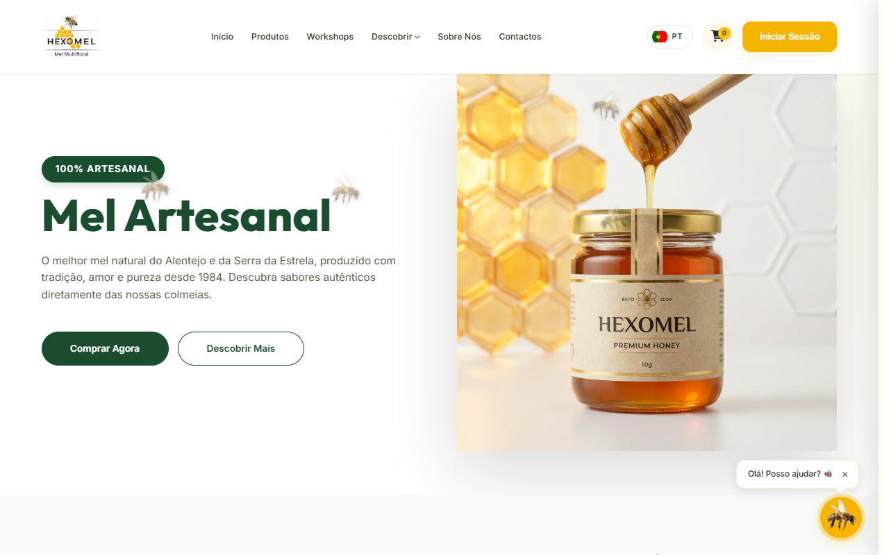

**Figura 7 — Página inicial da plataforma Hexomel.**

A página inicial é o primeiro contacto do utilizador com a plataforma. Este ecrã apresenta a identidade visual da Hexomel, com um slogan apelativo e chamadas à ação (CTAs) que incentivam o utilizador a explorar a loja e a conhecer os produtos. A interface foi desenhada de forma limpa e atrativa, contendo um menu de navegação que dá acesso à loja, aos workshops, às curiosidades, à comunidade, à informação institucional e aos contactos. Apresenta também alguns produtos em destaque e secções curtas que introduzem o compromisso da marca com o mel 100% natural e a apicultura artesanal tradicional.

---

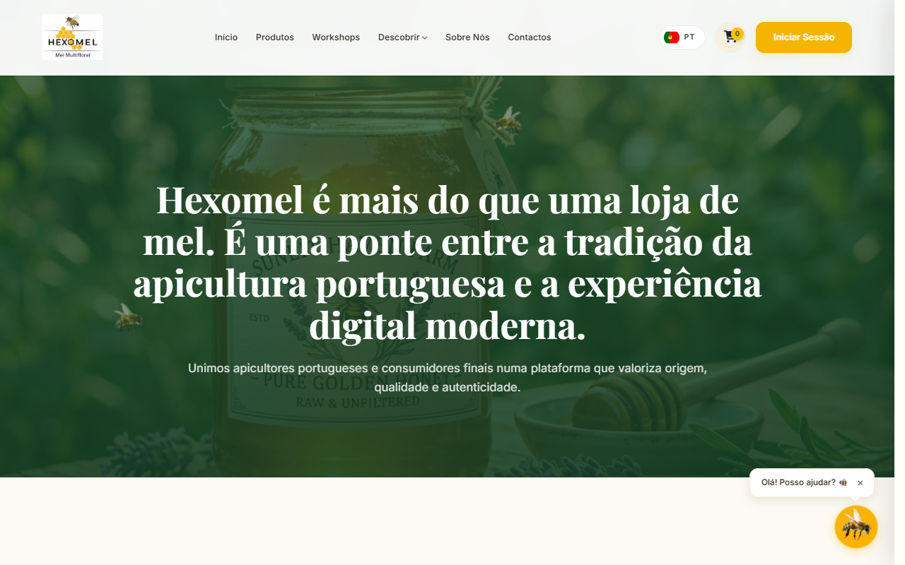

**Figura 8 — Página institucional "Sobre Nós".**

A página "Sobre Nós" apresenta o caráter institucional do projeto. O objetivo deste ecrã é transmitir o legado, a missão e a visão sustentável da marca. O utilizador encontra uma narrativa que descreve o processo tradicional de produção de mel na região da Serra da Estrela, acompanhada de fotografias reais de apicultores, colmeias e paisagens naturais. A organização deste ecrã foi pensada para transmitir segurança, qualidade e proximidade familiar, valores essenciais para o comércio de produtos biológicos.

---

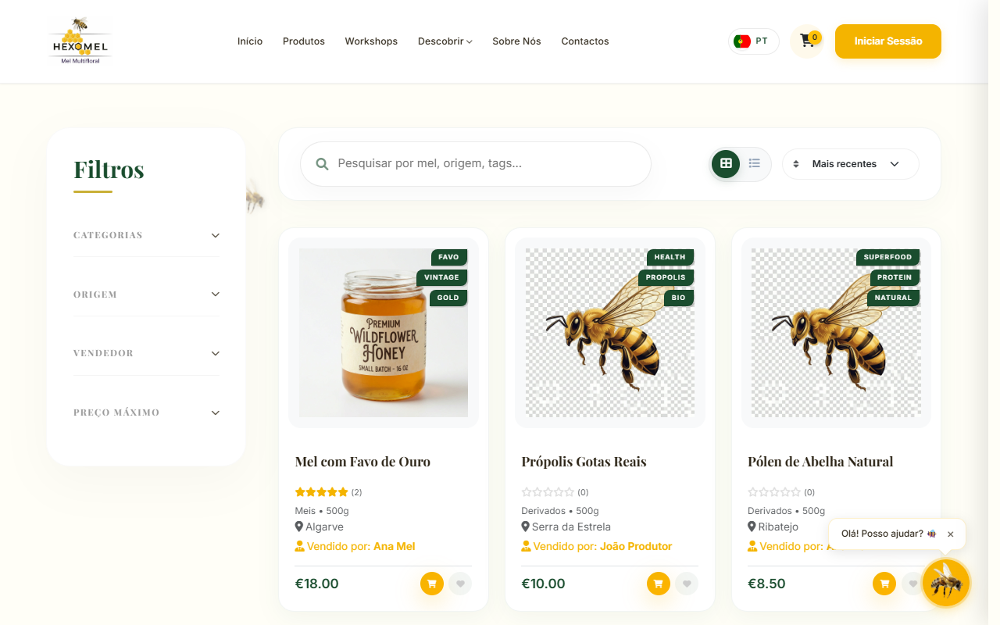

**Figura 9 — Catálogo de produtos com filtros na loja online.**

A página da loja online exibe o catálogo completo de produtos disponíveis, como méis de rosmaninho, urze, eucalipto e derivados da colheita (pólen e própolis). Do lado esquerdo, existe uma barra de filtros dinâmicos onde o utilizador pode pesquisar por palavras-chave, selecionar categorias, origens geográficas das colmeias ou filtrar por limite de preço. Os produtos são expostos em grelha responsiva contendo a imagem, a designação do artigo, o preço e a classificação média dada pelos clientes através de estrelas.

---

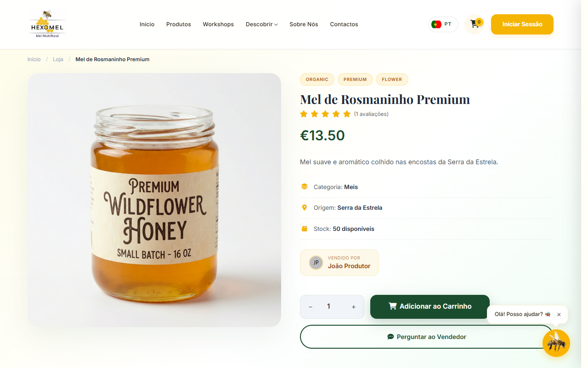

**Figura 10 — Ecrã de detalhes de um produto individual.**

Ao selecionar um produto na loja, o utilizador é direcionado para o ecrã de detalhes individuais. Este ecrã divide-se em duas colunas: a coluna da esquerda apresenta a imagem ampliada do mel e a secção de avaliações escritas por clientes; a coluna da direita detalha a descrição do mel, stock em armazém, preço, origem e categoria. Contém ainda um painel informativo sobre o apicultor que produziu aquele lote de mel, com foto e breve biografia, estimulando a valorização dos produtores nacionais e do comércio justo.

---

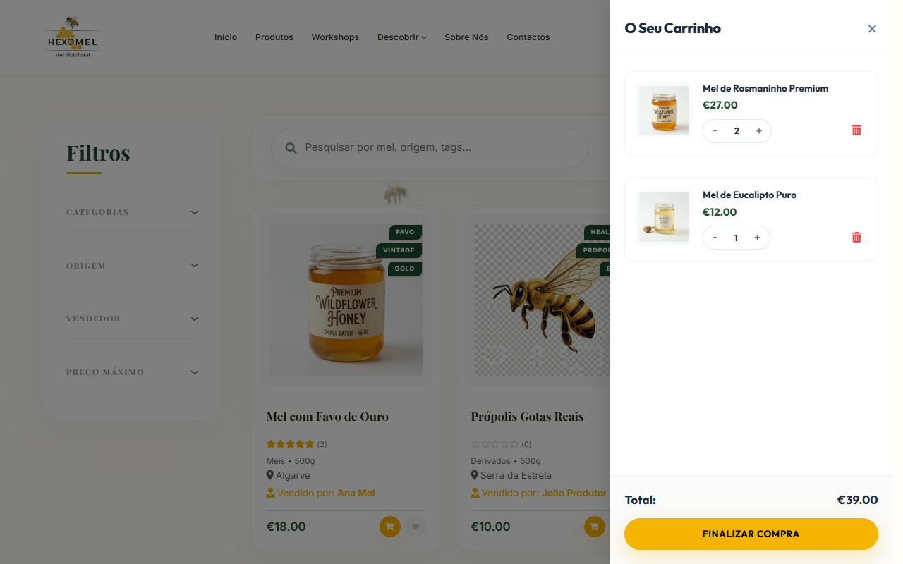

**Figura 11 — Painel lateral do carrinho de compras.**

O carrinho de compras é apresentado como uma barra lateral direita que surge de forma sobreposta no ecrã. O utilizador pode abrir esta barra a qualquer momento para verificar que produtos adicionou, ajustar a quantidade de cada item ou remover artigos sem ter de abandonar a página onde se encontra a navegar. No rodapé da barra lateral é mostrado o cálculo automático da soma total da encomenda e um botão destacado para encaminhar o utilizador para o processo de pagamento.

---

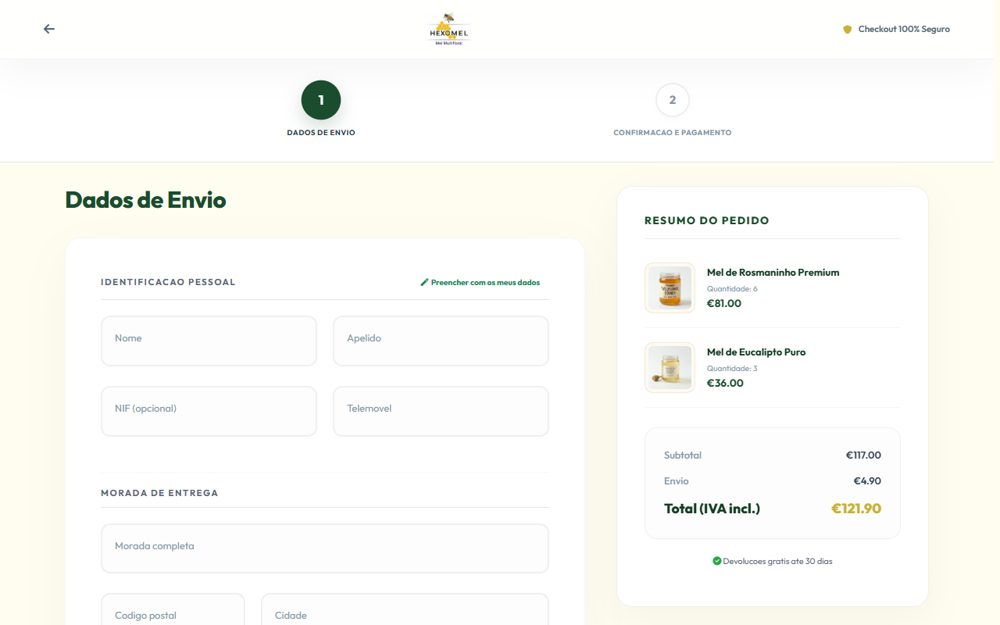

**Figura 12 — Ecrã de introdução de dados e finalização de compra.**

O ecrã de checkout permite ao utilizador registar a morada e concluir o processo de compra. A interface divide-se de forma organizada: a área da esquerda recolhe os dados pessoais, contacto telefónico e a morada detalhada de envio da encomenda, enquanto a secção da direita exibe um resumo final com a listagem dos artigos, o cálculo dos portes de envio e o preço final a pagar, integrando a gateway segura de pagamento por cartão de crédito.

---

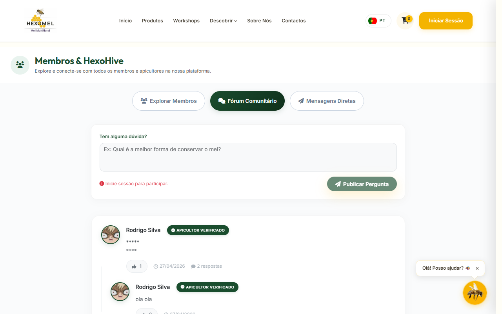

**Figura 13 — Fórum comunitário com perguntas e respostas.**

A área de comunidade funciona como um fórum público de partilha e esclarecimento de dúvidas entre apicultores e consumidores. Os utilizadores podem publicar perguntas gerais ou responder a dúvidas de outros membros. As respostas que forem fornecidas por profissionais registados são identificadas por uma moldura verde e pelo selo "Apicultor Verificado", garantindo credibilidade técnica às discussões da comunidade.

---

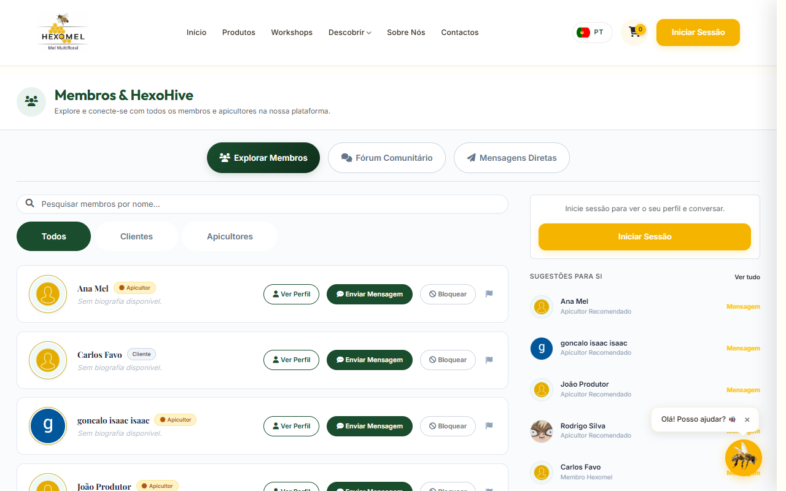

**Figura 14 — Feed de publicações na rede social HexoHive.**

O HexoHive é a rede social integrada na plataforma, permitindo um contacto mais informal entre a comunidade. A interface apresenta uma caixa de texto e imagem para criação de novas publicações no topo, seguida de um feed cronológico onde são exibidas as publicações dos membros. Os utilizadores podem interagir com as partilhas através de gostos e comentários, promovendo uma comunidade viva e interessada no mundo das abelhas.

---

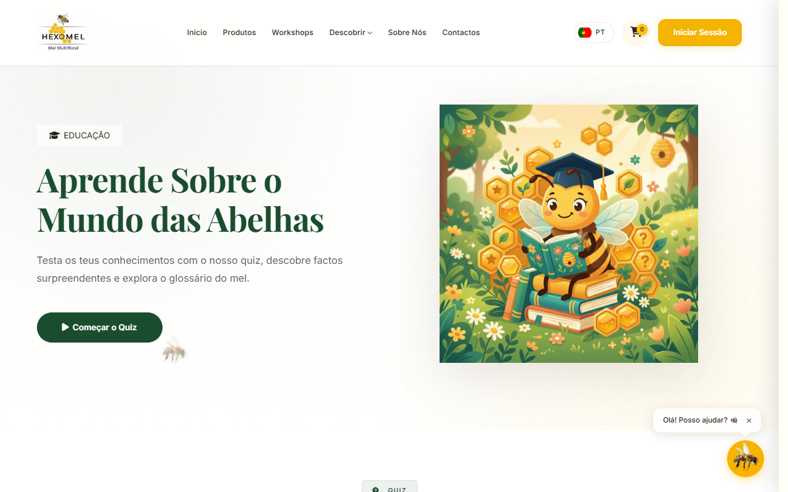

**Figura 15 — Secção educativa com quiz e glossário.**

Esta secção funciona como um centro de e-learning focado no ensino sobre as abelhas, a colheita de mel e a sustentabilidade ambiental. O ecrã apresenta no topo um quiz interativo com perguntas de escolha múltipla sobre apicultura, permitindo ao utilizador testar as suas competências lúdicas. Na metade inferior, é apresentado um glossário alfabético interativo, onde é possível pesquisar e filtrar termos científicos de apicultura de forma celeremente.

---

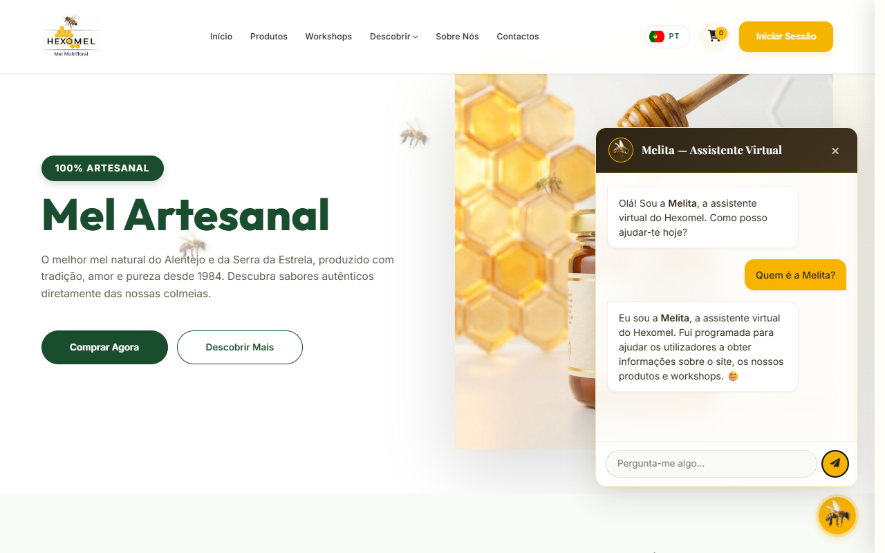

**Figura 16 — Janela de diálogo com a assistente virtual Melita.**

A Melita é a assistente virtual e mascote inteligente do site. A sua janela de diálogo surge ao clicar no botão flutuante posicionado no canto inferior direito das páginas. O utilizador pode dialogar de forma livre através da caixa de escrita inferior ou optar por clicar em sugestões rápidas (chips) pré-configuradas. A assistente responde fornecendo informações rápidas sobre produtos, parcerias locais, redes sociais, workshops ou indicando caminhos de navegação.

---

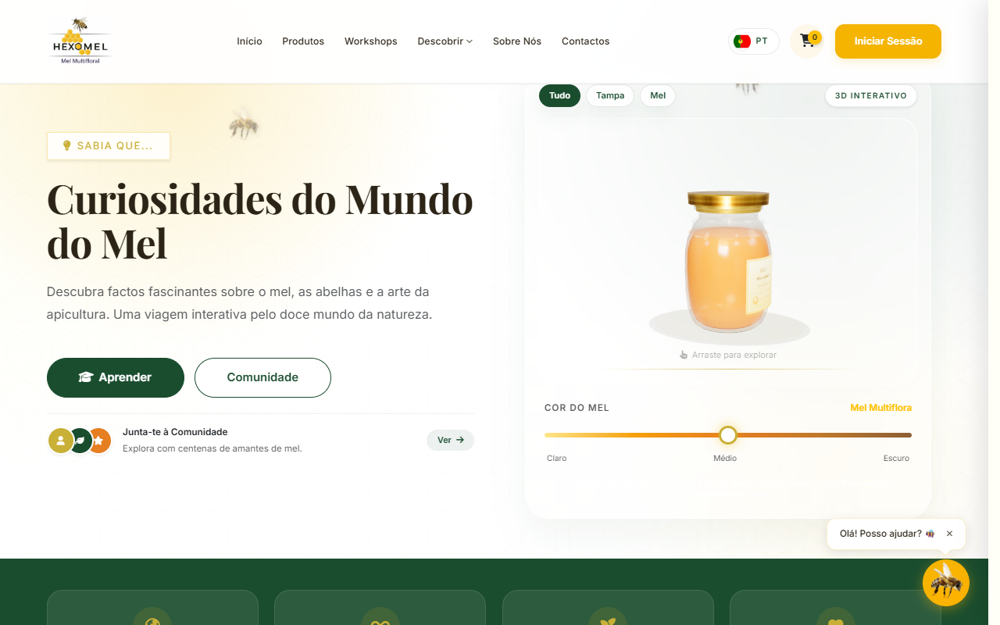

**Figura 17 — Visualização tridimensional interativa de frasco de mel.**

A página de curiosidades oferece uma experiência interativa avançada. O elemento central deste ecrã é a modelagem tridimensional fotorrealista de um frasco de mel Hexomel. Através do painel lateral de controlo deslizante, o utilizador pode transitar entre os diferentes tipos de meles biológicos disponíveis na loja. A alteração no painel de controlo altera visualmente e em tempo real a cor, a opacidade e a refração da luz do líquido no frasco 3D, simulando com fidelidade o mel real.

---

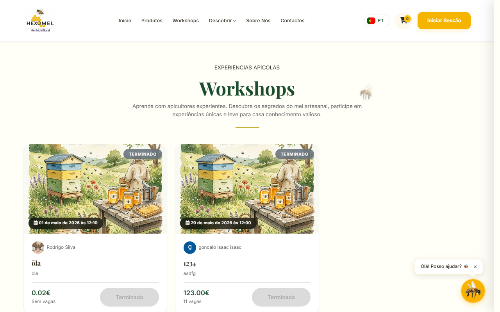

**Figura 18 — Lista de workshops de apicultura disponíveis.**

Este ecrã apresenta o catálogo de formações, sessões de aprendizagem e workshops práticos marcados nas colmeias dos apicultores parceiros. Os eventos são dispostos em formato de cartões visuais que reúnem a fotografia ilustrativa, o título da formação, a data, o horário, a localização, o preço e o número de vagas ainda disponíveis em tempo real. O utilizador registado pode clicar no botão para reservar o seu bilhete de participação.

---

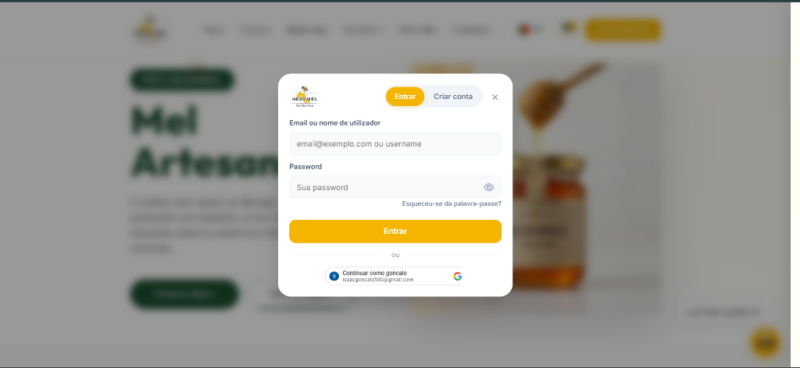

**Figura 19 — Janela modal de início de sessão e registo.**

O modal de autenticação é a janela central que surge no ecrã sempre que o utilizador deseja iniciar sessão ou efetuar o registo de uma nova conta no site. O layout da janela disponibiliza abas fáceis para alternar entre login e registo de novos utilizadores, campos básicos de preenchimento (e-mail e palavra-passe com controlo de visibilidade) e o botão integrado para efetuar login social rápido e seguro através da conta Google.

---

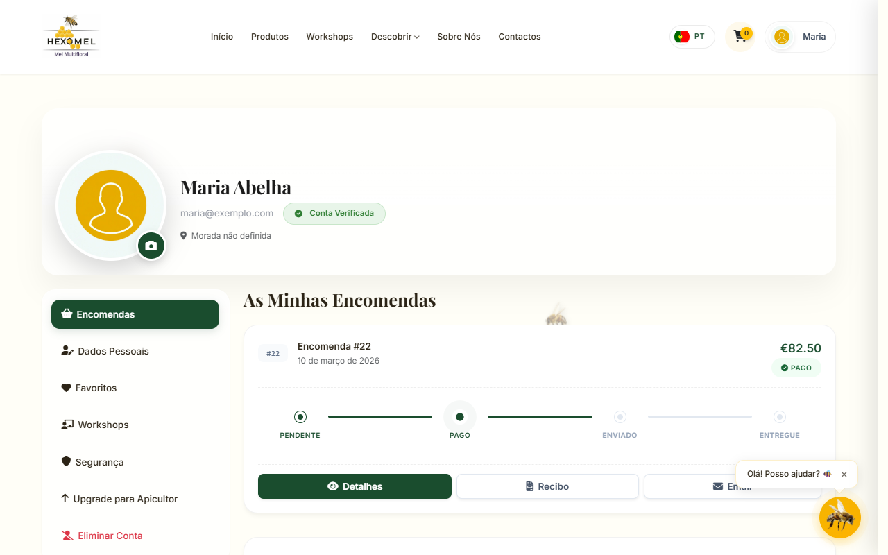

**Figura 20 — Ecrã de perfil do utilizador comum.**

A página de perfil pessoal destina-se a dar autonomia de gestão aos clientes registados da plataforma. A interface está dividida por áreas modulares num menu lateral, permitindo ao utilizador consultar e alterar os seus dados pessoais, verificar o histórico cronológico de encomendas e faturas já pagas, criar uma lista de produtos favoritos e gerir as definições de segurança da conta.

---

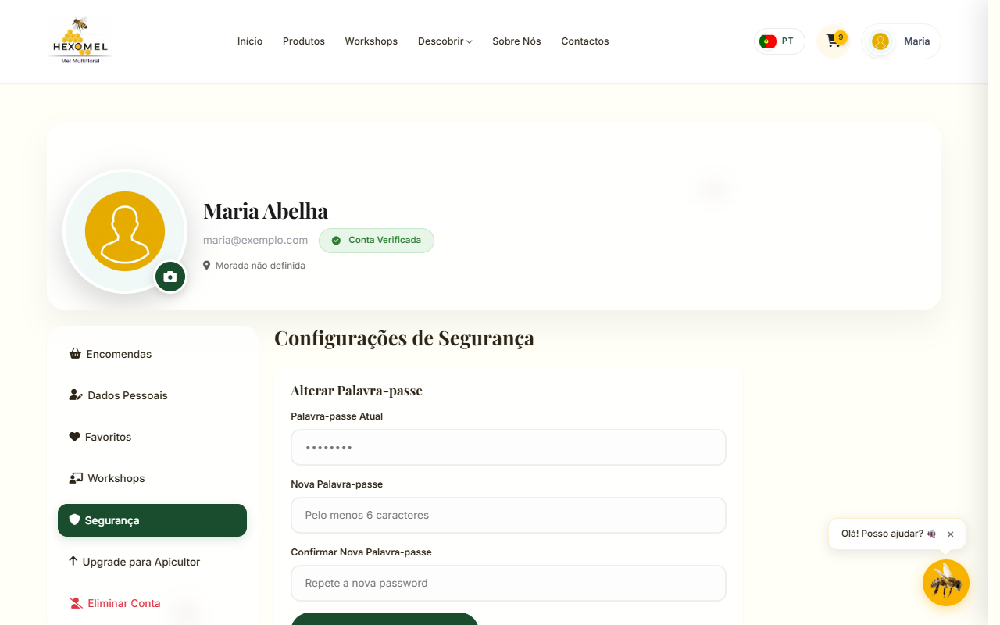

**Figura 21 — Separador de definições de segurança do perfil.**

Este ecrã permite ao utilizador gerir as definições de segurança e a proteção da sua conta na plataforma. O painel central exibe as opções para alteração de palavra-passe e apresenta o estado da autenticação de dois fatores (2FA). Quando ativa, esta camada adicional de segurança garante que qualquer transação crítica, como a finalização de compras ou a alteração de dados pessoais, requer uma verificação extra, protegendo a conta contra acessos não autorizados.

---

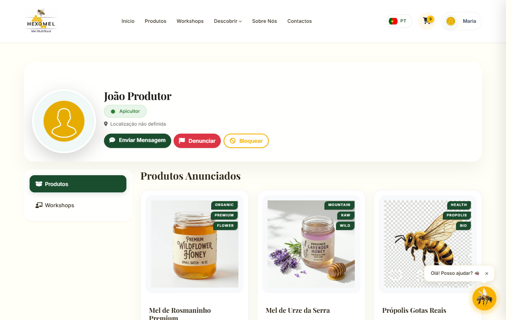

**Figura 22 — Perfil público do apicultor e vendedor parceiro.**

O ecrã de perfil do apicultor exibe a página de apresentação pública de um produtor parceiro da plataforma. Este ecrã reúne a imagem de perfil do apicultor, o seu selo de autenticidade, biografia e as opções de contacto social. Apresenta também, em grelhas dedicadas, os meles e derivados produzidos por si que estão à venda na loja, bem como a agenda dos próximos workshops de apicultura marcados para as suas colmeias, promovendo a proximidade direta entre o produtor e o consumidor final.

---

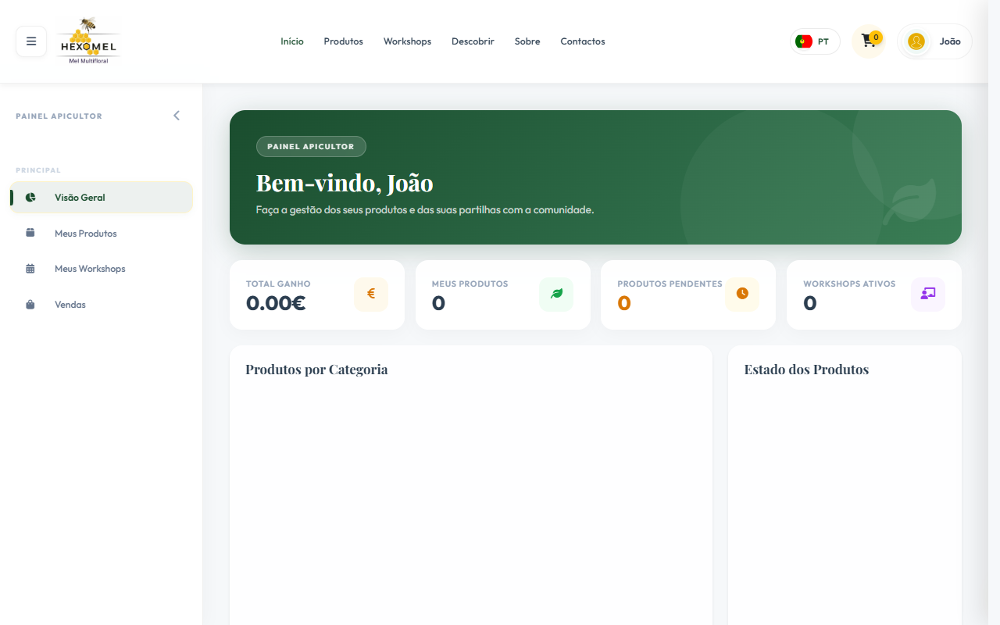

**Figura 23 — Painel de controlo e gestão para apicultores.**

O painel de apicultor é uma área reservada para os produtores parceiros gerirem a sua presença comercial no site. Neste ecrã, o apicultor pode cadastrar novos méis e derivados, definir preços de venda e gerir os níveis de stock. Dispõe também de abas para acompanhar o volume de faturação mensal do seu mel e para registar ou editar novas sessões de workshops de apicultura associadas ao seu apiário.

---

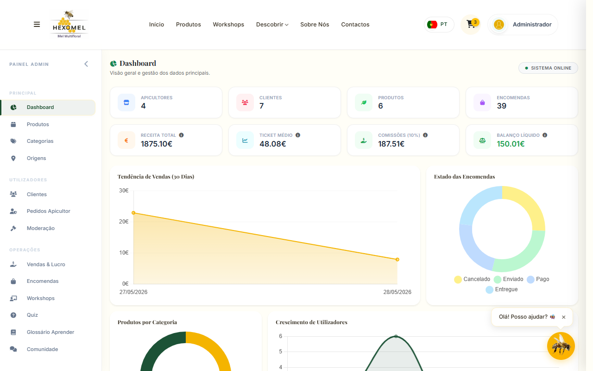

**Figura 24 — Painel administrativo com estatísticas e gráficos globais.**

O painel do administrador geral é o ecrã reservado à moderação e análise estatística global do Hexomel. O layout apresenta no topo indicadores chave (KPIs) com o número total de utilizadores, encomendas, faturas e mensagens. Na metade inferior, exibe gráficos estatísticos de vendas mensais e registo de novas contas no site. Contém também menus de controlo lateral para gerir utilizadores, locais de produção e gerir as publicações da comunidade e rede social.
