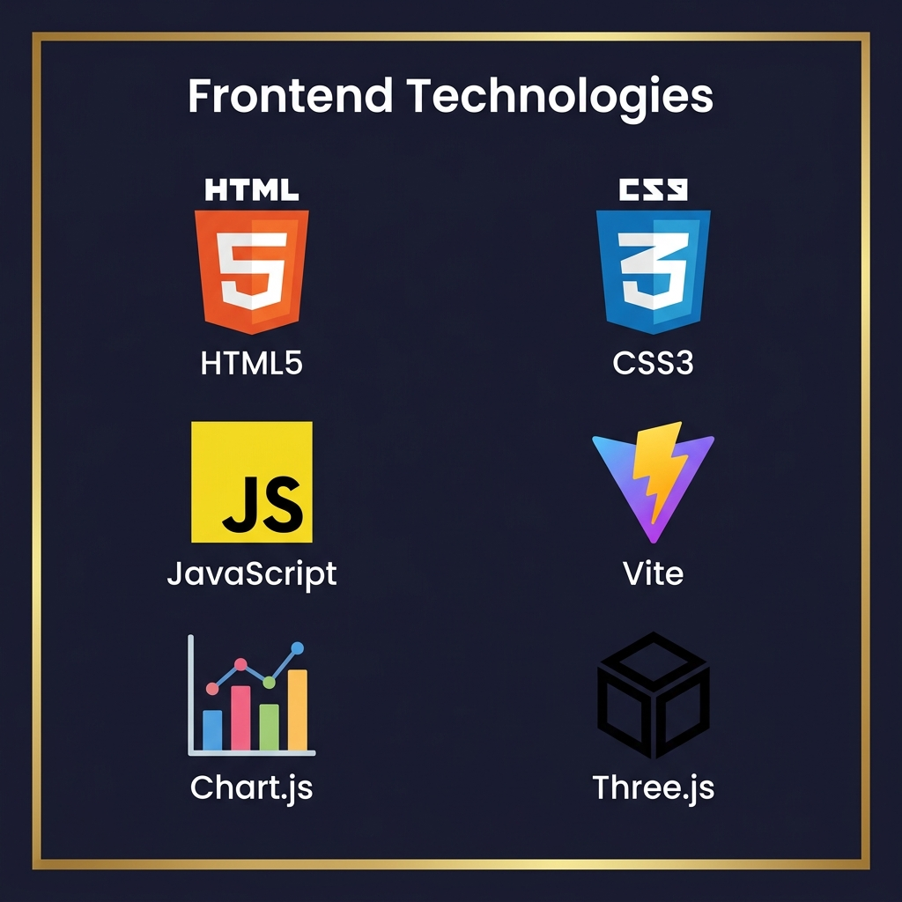
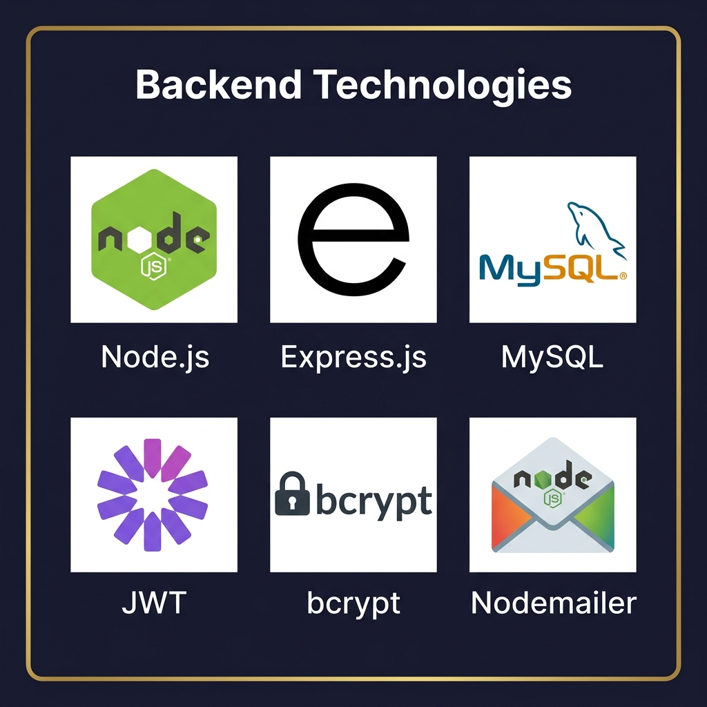

# Secção 4 — Tecnologias Utilizadas no Projeto Hexomel

> Esta secção apresenta em detalhe todas as tecnologias utilizadas no desenvolvimento da plataforma Hexomel, explicando o papel de cada uma, a razão da sua escolha e como foi aplicada no projeto.

---

## 4.1 Visão Geral do Stack Tecnológico

O Hexomel foi construído sobre um stack tecnológico moderno, dividido em três grandes grupos: **Frontend**, **Backend** e **Serviços Externos**. A escolha foi orientada por critérios de **performance**, **profissionalismo** e **boas práticas da indústria**.

---

## 4.2 Frontend — Camada de Apresentação



A camada de frontend é responsável por tudo o que o utilizador vê e com que interage diretamente no browser.

---

### 🟠 HTML5

**O que é:** HyperText Markup Language, versão 5. É a linguagem de marcação base da web moderna.

**Como foi usado no Hexomel:**
- Estruturação semântica de todas as páginas (`<header>`, `<main>`, `<section>`, `<article>`, `<footer>`);
- Utilização de `<meta name="view-transition" content="same-origin">` para ativar a **View Transitions API** nativa do browser;
- Formulários acessíveis com atributos `required`, `type`, `autocomplete` e `aria-label`;
- Tags `<meta>` para SEO dinâmico (título, descrição, og:image por página).

**Porquê HTML5 e não alternativas:**
O HTML5 é o padrão universal da web. O projeto optou por HTML puro (sem JSX ou templates de frameworks) para demonstrar domínio dos fundamentos e maximizar a compatibilidade cross-browser.

---

### 🔵 CSS3 / Vanilla CSS

**O que é:** Cascading Style Sheets, versão 3. Define a aparência visual de todas as páginas.

**Como foi usado no Hexomel:**
- **Design System centralizado** em `frontend/src/styles/modern.css` com variáveis CSS globais (cores, tipografia, sombras, border-radius);
- **CSS Grid e Flexbox** para layouts responsivos e complexos (dashboard, loja, checkout);
- **Animações e transições** com `@keyframes` (shimmer dos skeleton loaders, entrada de cards, BeeAnimator);
- **Glassmorphism** (`backdrop-filter: blur`) nos modais e painéis;
- **Media queries** para responsividade completa de 320px a 1440px;
- Ficheiros CSS separados por contexto: `skeleton.css`, `checkout.css`, `comunidade.css`, `i18n.css`, etc.

**Porquê Vanilla CSS e não Tailwind/Bootstrap:**
A escolha deliberada de CSS puro demonstra controlo total sobre o design. O resultado é uma identidade visual única, coerente e sem o peso visual genérico das frameworks de utilidade.

**Variáveis CSS principais do design system:**

| Variável | Valor | Função |
|----------|-------|--------|
| `--primary` | `#c8a04a` | Cor dourada principal (botões, destaques) |
| `--primary-dark` | `#a07830` | Hover dos botões dourados |
| `--bg-dark` | `#1a1a2e` | Fundo principal em dark mode |
| `--bg-card` | `#16213e` | Fundo de cards e painéis |
| `--text-light` | `#f0ebe1` | Texto sobre fundo escuro |
| `--accent-green` | `#2d5a27` | Verde floresta (badges apicultor) |
| `--border-gold` | `rgba(200,160,74,0.3)` | Bordas douradas subtis |

---

### 🟡 JavaScript ES6+ (Vanilla JS)

**O que é:** A linguagem de programação da web, utilizada para tornar as páginas dinâmicas e interativas.

**Como foi usado no Hexomel:**
- **Fetch API** para todas as comunicações com o backend (GET, POST, PUT, DELETE);
- **Módulos ES6** (`import`/`export`) para organização do código por funcionalidade;
- **LocalStorage** para persistência do carrinho, token JWT e preferências de idioma;
- **DOM Manipulation** avançada para renderização dinâmica de listas, cards e modais;
- **Async/Await** em todo o código assíncrono para legibilidade e manutenção;
- **Template Literals** para geração de HTML dinâmico com escape de XSS;
- **Classes ES6** para encapsulamento da lógica dos módulos mais complexos (Admin, Apicultor, Comunidade).

**Porquê JavaScript puro e não React/Vue/Angular:**
A decisão foi técnica e pedagógica: demonstrar que é possível criar uma experiência de nível SPA sem depender de frameworks pesados, utilizando APIs nativas modernas do browser.

---

### ⚡ Vite

**O que é:** Ferramenta de build moderna e ultra-rápida para projetos web. Substitui o Webpack com uma abordagem baseada em ES Modules nativos.

**Versão utilizada:** Vite 5.x

**Como foi usado no Hexomel:**
- **Servidor de desenvolvimento** com Hot Module Replacement (HMR) instantâneo;
- **Bundling de produção** com otimização automática (tree-shaking, code splitting, minificação);
- **Resolução de módulos** JavaScript e CSS sem configuração complexa;
- **Proxy de desenvolvimento** para comunicação com o backend Node.js sem problemas de CORS.

**Vantagens sobre alternativas (Create React App, Webpack):**

| Aspeto | Vite | Webpack |
|--------|------|---------|
| Tempo de arranque | < 300ms | 5–30s |
| HMR (hot reload) | Instantâneo | 1–5s |
| Configuração | Mínima | Complexa |
| Suporte ES Modules | Nativo | Compilado |

---

### 📊 Chart.js

**O que é:** Biblioteca JavaScript open-source para criação de gráficos interativos e responsivos.

**Versão utilizada:** Chart.js 4.x

**Como foi usado no Hexomel:**
O dashboard de administração integra **6 gráficos** com dados reais da base de dados:

| Gráfico | Tipo Chart.js | Dados Apresentados |
|---------|--------------|-------------------|
| Receita dos últimos 30 dias | `line` | Faturação diária |
| Distribuição por categoria | `doughnut` | Vendas por tipo de mel |
| Estado das encomendas | `bar` | Pendente / Pago / Enviado |
| Crescimento de utilizadores | `line` | Novos utilizadores (12 meses) |
| Top Produtos | `bar` (horizontal) | Produtos por receita |
| Performance de Parceiros | `bar` | Vendas por apicultor |

Todos os gráficos atualizam com dados reais via Fetch API ao carregar o dashboard, e são totalmente responsivos.

---

### 🎲 Three.js

**O que é:** Biblioteca JavaScript para renderização 3D no browser usando WebGL.

**Versão utilizada:** Three.js r165

**Como foi usado no Hexomel:**
Na página de Curiosidades, o Three.js renderiza um **frasco de mel fotorrealista em 3D** com:
- `MeshPhysicalMaterial` — material com refração, transmissão e absorção de luz;
- `PointLight` e `AmbientLight` para iluminação realista;
- Simulação de **5 tipos de mel** com propriedades físicas distintas:

| Tipo de Mel | Cor | Transmissão | Atenuação | Densidade Visual |
|-------------|-----|-------------|-----------|-----------------|
| Alfazema | Amarelo pálido | Alta | Baixa | Cristalino |
| Laranjeira | Âmbar claro | Média-alta | Média | Semitransparente |
| Multiflora | Âmbar dourado | Média | Média | Opaco-suave |
| Eucalipto | Âmbar escuro | Média-baixa | Alta | Semi-opaco |
| Urze | Castanho escuro | Baixa | Muito alta | Quase opaco |

O utilizador interage com um slider que muda o tipo de mel em tempo real, recalculando todas as propriedades físicas do material.

---

## 4.3 Backend — Camada de Lógica de Negócio



O backend é o "cérebro" da aplicação — processa pedidos, aplica regras de negócio, gere a autenticação e comunica com a base de dados.

---

### 🟢 Node.js

**O que é:** Ambiente de execução JavaScript do lado do servidor, baseado no motor V8 do Chrome.

**Versão utilizada:** Node.js 18+ (LTS)

**Como foi usado no Hexomel:**
- Servidor principal que executa toda a lógica de backend;
- Gestão de ficheiros (leitura do logo para incorporação CID nos emails);
- Scripts de setup e migração da base de dados (`scripts/`);
- Processamento de variáveis de ambiente (`.env`) com `dotenv`.

**Porquê Node.js:**
Permite usar JavaScript tanto no frontend como no backend, reduzindo a curva de aprendizagem e facilitando a partilha de lógica. É o mais usado no mercado para APIs REST, com um ecossistema npm vasto.

---

### ⬛ Express.js

**O que é:** Framework minimalista para Node.js, utilizado para criar servidores HTTP e APIs REST de forma estruturada.

**Versão utilizada:** Express 4.x

**Como foi usado no Hexomel:**
- Definição de todas as rotas da API (`/api/produtos`, `/api/clientes`, `/api/encomendas`, etc.);
- **Middlewares** de autenticação JWT, validação de roles e tratamento de erros;
- Gestão de CORS (Cross-Origin Resource Sharing) para comunicação segura com o frontend;
- Integração com Multer para upload de ficheiros;
- Servir ficheiros estáticos da pasta `frontend/public/uploads/`.

**Estrutura das Rotas API (exemplos):**

| Método | Rota | Função | Autenticação |
|--------|------|--------|--------------|
| `POST` | `/api/auth/login` | Login por email/username | ❌ Pública |
| `POST` | `/api/auth/register` | Registo de novo utilizador | ❌ Pública |
| `GET` | `/api/produtos` | Listar catálogo com filtros | ❌ Pública |
| `POST` | `/api/produtos` | Criar produto | ✅ Apicultor/Admin |
| `GET` | `/api/encomendas/minha` | Histórico do utilizador | ✅ Cliente |
| `GET` | `/api/admin/dashboard` | Dados do dashboard | ✅ Admin |
| `POST` | `/api/checkout/stripe` | Iniciar sessão de pagamento | ✅ Cliente + 2FA |

---

### 🐬 MySQL 8.0

**O que é:** Sistema de Gestão de Bases de Dados Relacionais (SGBDR) open-source, um dos mais utilizados no mundo.

**Versão utilizada:** MySQL Community Server 8.0

**Como foi usado no Hexomel:**
- Armazenamento de **todos os dados estruturados** da plataforma (15 tabelas);
- Motor **InnoDB** para suporte a transações ACID e chaves estrangeiras;
- Charset **utf8mb4** para suporte completo a Unicode (incluindo emojis);
- Tipo de dados **JSON nativo** (MySQL 8.0) na tabela `interacao` para analytics flexível;
- Índices (`KEY`, `UNIQUE KEY`, `idx_status`) para performance em consultas frequentes;
- Inicialização automática via `npm run db:setup` com o ficheiro `hexomel_mysql.sql`.

**Porquê MySQL e não alternativas:**

| Critério | MySQL | SQLite | MongoDB |
|----------|-------|--------|---------|
| Relações complexas (FK) | ✅ Excelente | ⚠️ Limitado | ❌ Não relacional |
| Acessos concorrentes | ✅ Excelente | ❌ Fraco | ✅ Bom |
| Transações ACID | ✅ InnoDB | ⚠️ Básico | ⚠️ Parcial |
| Padrão da indústria | ✅ Muito usado | ❌ Apenas local | ✅ Usado em NoSQL |
| Ferramentas de gestão | ✅ Workbench | ❌ Limitadas | ✅ Compass |

---

### 🔑 JWT — JSON Web Tokens

**O que é:** Padrão aberto (RFC 7519) para transmissão segura de informação entre partes como um objeto JSON assinado digitalmente.

**Biblioteca:** `jsonwebtoken` (npm)

**Como foi usado no Hexomel:**
- Gerado no momento do login e enviado ao cliente como resposta;
- Armazenado no `localStorage` do browser;
- Incluído em cada pedido à API no header `Authorization: Bearer <token>`;
- Verificado pelo middleware do Express antes de executar rotas protegidas;
- Contém o payload: `{ id, email, role, username }` — sem dados sensíveis.

**Estrutura de um JWT:**
```
HEADER.PAYLOAD.SIGNATURE
eyJhbGciOiJIUzI1NiJ9.eyJpZCI6MSwiZW1haWwiOiJhZG1pbiJ9.abc123...
```

**Vantagens do JWT vs Sessões de Servidor:**

| Aspeto | JWT (Stateless) | Sessions (Stateful) |
|--------|----------------|---------------------|
| Escalabilidade | ✅ Alta (sem estado no servidor) | ❌ Requer sessão partilhada |
| Performance | ✅ Sem consulta à BD por pedido | ❌ Consulta à BD em cada pedido |
| Segurança | ✅ Assinado com secret | ✅ Controlado pelo servidor |
| Expiração | ✅ Configurável no token | ✅ Configurável na sessão |

---

### 🔒 bcryptjs

**O que é:** Biblioteca de hashing de passwords baseada no algoritmo bcrypt, que inclui automaticamente um "salt" aleatório para evitar ataques de rainbow table.

**Como foi usado no Hexomel:**
- Todas as passwords são processadas com `bcrypt.hash(password, 10)` antes de serem guardadas;
- Na autenticação, `bcrypt.compare(inputPassword, storedHash)` verifica a correspondência;
- O número de "salt rounds" (10) garante um equilíbrio entre segurança e performance.

**Porquê bcrypt e não MD5/SHA:**

| Algoritmo | Resistência a força bruta | Salt automático | Adequado para passwords |
|-----------|--------------------------|-----------------|------------------------|
| **bcrypt** | ✅ Alta (lento por design) | ✅ Sim | ✅ Sim |
| MD5 | ❌ Muito fraco | ❌ Não | ❌ Não |
| SHA-256 | ⚠️ Médio (rápido demais) | ❌ Não | ❌ Não recomendado |

---

### 📧 Nodemailer

**O que é:** Módulo Node.js para envio de emails através de servidores SMTP.

**Como foi usado no Hexomel:**
- **Emails de verificação 2FA:** Código OTP temporizado enviado antes do checkout;
- **Recibos de encomenda:** Template HTML profissional com logótipo incorporado (CID);
- **Configuração Gmail:** SMTP `smtp.gmail.com` porta 587 (TLS) com App Password de 16 dígitos;
- **Modo desenvolvimento:** Fallback para Ethereal (servidor de email de teste) quando Gmail não está configurado;
- **Logo CID:** O logo é enviado como attachment inline para evitar bloqueio por clientes de email.

```javascript
// Configuração do transportador SMTP
const transporter = nodemailer.createTransport({
  host: 'smtp.gmail.com',
  port: 587,
  secure: false, // TLS
  auth: {
    user: process.env.EMAIL_USER,
    pass: process.env.EMAIL_APP_PASSWORD // App Password de 16 dígitos
  }
});
```

---

## 4.4 Serviços Externos e Ferramentas


---

### 💳 Stripe

**O que é:** Plataforma líder mundial de processamento de pagamentos online.

**Como foi usado no Hexomel:**
- Integração via **Stripe Checkout** (hosted page) para pagamento seguro com cartão;
- O backend cria uma **Stripe Session** com os produtos, preços e imagens;
- Após pagamento bem-sucedido, o Stripe redireciona para a página de confirmação;
- **Suporte Ngrok:** Sistema inteligente que usa `CHECKOUT_PUBLIC_BASE_URL` para expor imagens de produtos locais ao Stripe durante desenvolvimento;
- **Dynamic Image Mocking:** Fallback automático para placeholders Unsplash temáticos sem túnel público.

**Ciclo de vida da encomenda com Stripe:**
```
Cliente clica "Pagar"
    → Backend cria Stripe Session
    → Cliente é redirecionado ao Stripe
    → Stripe processa o cartão
    → Webhook / redirect de sucesso
    → Backend atualiza Status para "Pago"
    → Email de confirmação enviado
```

---

### 🔐 Google OAuth 2.0

**O que é:** Protocolo de autorização que permite ao utilizador autenticar-se com a sua conta Google sem partilhar a password com o Hexomel.

**Como foi usado no Hexomel:**
- Botão "Entrar com Google" nas páginas de login e registo;
- O Google devolve um token de identidade (`id_token`) que o backend verifica;
- Se o email ainda não existe na BD, é criado um novo utilizador automaticamente;
- Se já existe, autentica o utilizador diretamente.

**Fluxo OAuth 2.0:**
```
Utilizador clica "Login com Google"
    → Popup Google (seleciona conta)
    → Google devolve id_token
    → Backend verifica token com Google API
    → Cria/encontra utilizador na BD
    → Devolve JWT do Hexomel
    → Utilizador autenticado
```

---

### 🛠️ MySQL Workbench

**O que é:** Ferramenta visual oficial da Oracle para design, administração e gestão de bases de dados MySQL.

**Versão utilizada:** MySQL Workbench 8.0

**Como foi usado no Hexomel:**
- **Modelação visual** do esquema de tabelas e relações;
- **Execução de queries SQL** para verificação e debugging de dados;
- **Administração da BD:** criação de utilizadores, configuração de permissões;
- **Import/Export** do ficheiro `hexomel_mysql.sql` para setup e reset da BD.

**Porquê Workbench e não phpMyAdmin:**

| Critério | MySQL Workbench | phpMyAdmin |
|----------|----------------|-----------|
| Padrão da indústria | ✅ Ferramenta oficial Oracle | ❌ Mais académico |
| Modelação visual (ER) | ✅ Integrada | ❌ Não tem |
| Instalação | ✅ Standalone | ❌ Requer WAMP/XAMPP |
| Performance de queries | ✅ Query Profiler | ⚠️ Básico |
| Ambiente limpo | ✅ Sem dependências extra | ❌ Pilha WAMP |

---

### 📁 Multer

**O que é:** Middleware Node.js para processamento de uploads de ficheiros via formulários `multipart/form-data`.

**Como foi usado no Hexomel:**
- Upload de **imagens de produtos** (mel, embalagens) pelos Apicultores;
- Upload de **avatar/foto de perfil** pelos utilizadores (suporte a base64 e ficheiro);
- Upload de **documentos de upgrade** (PDF ou imagem) para pedidos de Apicultor;
- Ficheiros guardados em `frontend/public/uploads/` — o caminho é guardado na BD MySQL.

**Configuração no projeto:**
```javascript
const storage = multer.diskStorage({
  destination: 'frontend/public/uploads/',
  filename: (req, file, cb) => {
    cb(null, Date.now() + '-' + file.originalname);
  }
});
const upload = multer({ storage, limits: { fileSize: 5 * 1024 * 1024 } }); // 5MB
```

---

### 🍬 SweetAlert2

**O que é:** Biblioteca JavaScript que substitui as caixas de diálogo nativas do browser (`alert`, `confirm`, `prompt`) por popups estilizados, animados e responsivos.

**Como foi usado no Hexomel:**
- **Confirmações de eliminação** de produtos, posts, utilizadores (com botão de cancelar);
- **Alertas de erro** com ícone e mensagem formatada (ex: stock insuficiente);
- **Alertas de sucesso** após ações importantes (ex: encomenda concluída);
- **Expiração de sessão:** Alert informativo quando o token JWT expira, com redirecionamento para login;
- **Formulários inline:** Em algumas ações, o SweetAlert2 apresenta campos de input internamente.

---

### 🌐 Ngrok

**O que é:** Ferramenta que cria túneis seguros HTTPS para expor servidores locais (`localhost`) à internet pública.

**Como foi usado no Hexomel:**
O Stripe Checkout precisa de carregar as imagens dos produtos a partir de uma URL pública HTTPS. Durante o desenvolvimento local, as imagens estão em `localhost` — inacessível ao Stripe.

**Solução implementada:**
1. O developer inicia o Ngrok: `ngrok http 3001`;
2. O Ngrok gera uma URL pública: `https://abc123.ngrok.io`;
3. Esta URL é definida em `.env` como `CHECKOUT_PUBLIC_BASE_URL=https://abc123.ngrok.io`;
4. O backend usa esta URL para construir os links das imagens enviados ao Stripe.

```
localhost:3001 ←→ Ngrok Tunnel ←→ https://abc123.ngrok.io ←→ Stripe
```

---

## 4.5 Justificação Global do Stack

A combinação escolhida — **Vanilla JS + Vite + Node.js + Express + MySQL** — representa um stack **profissional, moderno e sem excesso de complexidade**. Em vez de depender de mega-frameworks que ocultam o funcionamento real da web, o Hexomel foi construído com tecnologias fundamentais, demonstrando:

1. **Compreensão profunda** da web (HTML, CSS, JS nativos);
2. **Capacidade de backend** (API REST, autenticação, BD relacional);
3. **Integração de serviços reais** (Stripe, Google OAuth, email SMTP);
4. **Boas práticas de segurança** (JWT, bcrypt, 2FA, sanitização);
5. **UX de nível profissional** (SweetAlert2, Chart.js, Three.js, skeleton loaders).

---

*Secção elaborada para a PAP — Hexomel | Ano Letivo 2025/2026*
